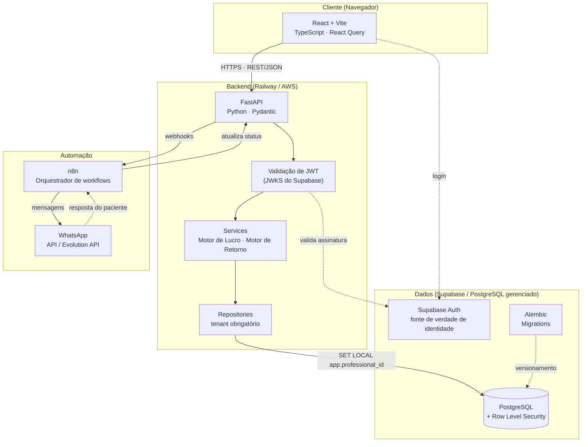
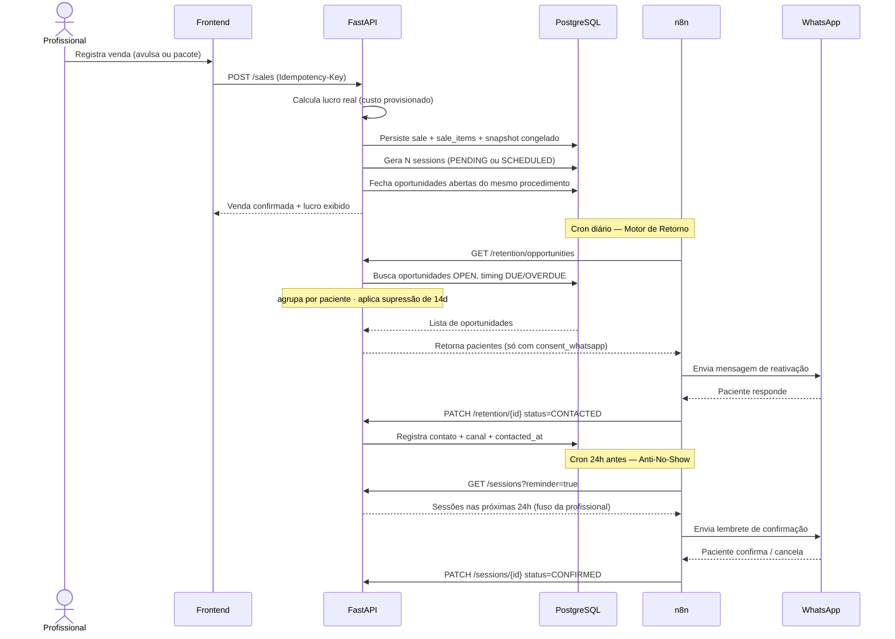
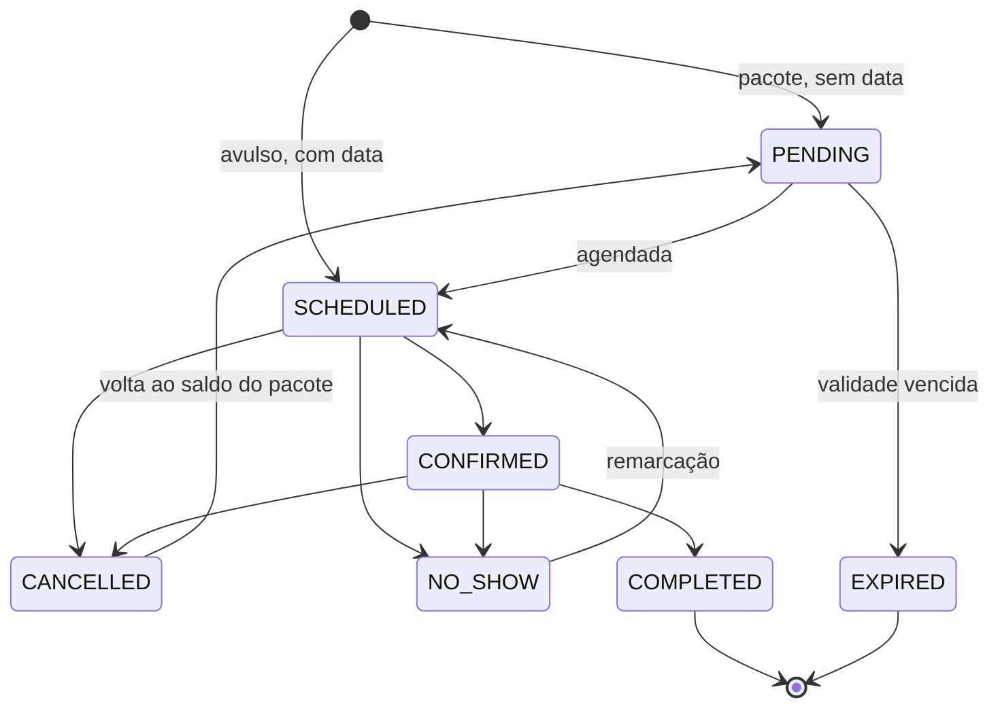
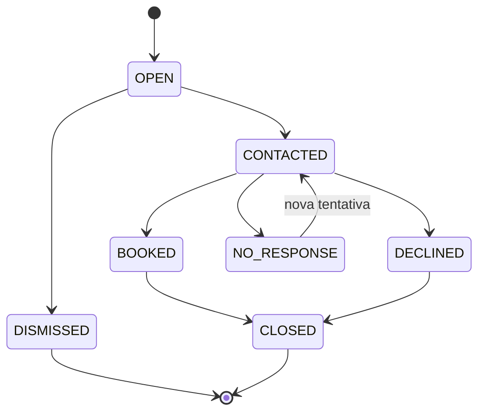

# MVP — Micro-SaaS para Gestão Financeira e Retenção em Estética

**Versão 6** · Agenda mínima e separação entre MVP e visão de produto.

> **O que mudou da v5 para a v6.** Duas coisas. **(1) Agenda mínima entrou** (§16) — não por pedido, mas porque o modelo de pacote da v4 criou sessões `PENDING` sem nenhuma forma de agendá-las, o que forçaria a profissional a combinar data fora do sistema e voltar para registrar. O épico traz uma lista explícita do que **não** entra, para servir de defesa quando pedirem mais. **(2) Visão de produto separada do escopo** (§31) — o antigo "P2" era um cemitério de ideias sem critério; agora há estágios com condição de entrada, e a anamnese está registrada ali, com o motivo de não caber no MVP. Mudanças marcadas com 🆕 (novo) e 🔧 (corrigido).

> **Como ler este documento.** §1 a §29 são o **MVP** — o que será construído para validar a hipótese. §31 é a **visão** — o que o produto pode virar depois, com critério de entrada por estágio. Nada da visão entra antes de a hipótese ser validada, por mais barato que pareça.

---

## Eixos de configuração do produto

> 🔧 **v5 — Seção reenquadrada.** Antes se chamava "decisões bloqueantes", como se houvesse uma resposta certa a descobrir. Não há: **cada profissional e cada clínica opera diferente**, e o produto precisa comportar a variação. A entrevista com a cliente zero (TASK-044) não serve para *decidir a regra* — serve para *popular os defaults* e produzir o primeiro caso de teste real.

### Duas naturezas distintas 🆕

A distinção abaixo é a mais importante desta seção, porque determina o que pode esperar e o que não pode.

| | **Configuração** | **Capacidade do modelo** |
|---|---|---|
| O que é | Um campo que varia por profissional | Uma estrutura que existe ou não existe |
| Exemplo | "A taxa é dela ou da clínica?" | "O sistema suporta pacotes?" |
| Custo de adicionar depois | Migration barata, uma coluna | **Reescrever o núcleo** |
| Pode esperar? | Sim, se o default for honesto | Não |

É por isso que pacotes (E3) e custo variável (E5) precisavam ser resolvidos antes de codar, enquanto antecipação de recebíveis (E7) pode entrar depois sem dor.

### Os eixos

| # | Eixo | Natureza | Onde vive | Quando |
|---|---|---|---|---|
| **E1** | Quem paga a taxa da maquininha | Configuração | `financial_settings.fee_payer` | **P0** |
| **E2** | Base de cálculo do split | Configuração | `financial_settings.split_base` | **P0** |
| **E3** | Venda de pacotes | **Capacidade** | `sales` / `sale_items` / `sessions` | **P0** ✅ resolvido §11 |
| **E4** | Parcelamento no cartão | Configuração | `payment_fee_rules` (faixas) | **P0** |
| **E5** | Custo variável por paciente | **Capacidade** | `sessions.cost_override` | **P0** ✅ resolvido §12 |
| **E6** | Split diferente por procedimento | Configuração | `procedures.split_override` | P1 🔧 |
| **E7** | Antecipação de recebíveis | Configuração | `financial_settings.anticipation_*` | P1 🔧 |

> 🔧 **v5 — E6 e E7 movidos para P1.** São refinamentos que a maioria das profissionais não usa no início, e a coluna pode ser adicionada depois sem dor. Manter no P0 alongaria o onboarding — e onboarding longo mata ativação, que é justamente o risco que o EPIC-12 existe para mitigar. Ver §8.3 para o que muda quando entrarem.

**E1, E2 e E4 ficam no P0** porque afetam **toda** venda. Errar neles não produz um número aproximado: produz um número errado com aparência de certo, no exato indicador que justifica a assinatura.

### Eixos do modelo de pacote 🆕

| # | Eixo | Natureza | Default de mercado |
|---|---|---|---|
| **E8** | Pacote tem validade | Configuração | Não (`NULL` = sem prazo) |
| **E9** | Sessão abandonada libera custo | Regra fixa | Sim, via `EXPIRED` (§11.4) |
| **E10** | Desconto de pacote rateado por item | Regra fixa | Sim, proporcional (§11.5) |

E9 e E10 são regras contábeis, não preferências — não precisam ser configuráveis.

### O papel da entrevista com a cliente zero 🔧

> 🔧 **v5 — Propósito redefinido.** Não é "descobrir como o sistema deve calcular". É: (a) validar que os eixos cobrem um caso real, (b) produzir o primeiro conjunto de dados de teste, (c) calibrar os defaults de mercado.

Se a configuração dela **não couber** nos eixos existentes, isso é um achado de produto — falta um eixo. Se couber, os eixos estão certos e ela vira um caso de teste nomeado.

**Como conduzir:** perguntas em linguagem natural, nunca técnica. "Quando você passa R$ 1.000 no cartão, quanto cai na sua conta e quando?" revela E1, E2, E4 e E7 de uma vez.

---

## 1. Objetivo do MVP

Construir uma primeira versão do SaaS capaz de ajudar profissionais autônomos de estética a:

1. Registrar seus atendimentos.
2. Calcular automaticamente o **lucro real** de cada procedimento.
3. Visualizar faturamento, custos, lucro e margem.
4. Identificar pacientes que estão próximas do momento de retorno.
5. Criar uma fila de pacientes que precisam ser reativadas.
6. Reduzir no-shows através de lembretes.
7. Medir a **receita recuperada através do sistema**.

### Hipótese principal

> Se o sistema conseguir mostrar claramente o lucro real e recuperar pacientes que seriam esquecidas, a profissional estará disposta a pagar uma assinatura mensal pelo produto.

### Hipótese de invalidação 🆕

Uma hipótese que não pode ser refutada não está sendo testada. O critério de refutação é:

> Se a receita atribuível ao sistema (§18, com a atribuição conservadora definida lá) for **inferior à mensalidade** ao longo de 60 dias, a hipótese está refutada — independentemente de a usuária dizer que gosta do produto.

Isso importa porque o instrumento de medição da v2 estava enviesado a favor de continuar. Ver §18.1.

---

## 2. Estratégia do MVP

O MVP **não será um sistema completo de gestão de clínicas**.

Não teremos inicialmente:

- prontuário clínico completo (inclui **anamnese** — ver §31.5); 🔧 v6
- **agenda completa** — há uma agenda *mínima* (§16), deliberadamente limitada; 🔧 v6
- TISS;
- ERP;
- estoque avançado;
- gestão contábil;
- integração com múltiplos gateways;
- BI avançado;
- IA sofisticada;
- marketplace;
- aplicativo mobile nativo.

> 🔧 **v6 — Duas entradas ganharam nuance.** "Agenda completa" continua fora, mas a agenda mínima entrou porque o modelo de pacote a tornou necessária — §16.4 delimita exatamente onde a linha foi traçada. "Prontuário" continua fora, e agora com destino registrado: §31.5 explica por que anamnese não cabe no MVP e o que ela exigiria.

### O foco será

```text
ATENDIMENTO
     ↓
CUSTOS
     ↓
LUCRO REAL
     ↓
PRÓXIMO RETORNO
     ↓
REATIVAÇÃO
     ↓
NOVA RECEITA
```

### Walking skeleton primeiro 🆕

Antes de aprofundar qualquer camada, entregar o fluxo mais fino possível ponta a ponta **em produção**:

```text
login → cadastrar 1 paciente → cadastrar 1 procedimento
      → registrar 1 atendimento → ver o lucro na tela
```

Isso valida Supabase↔FastAPI, deploy, autenticação e o modelo financeiro de uma vez. É o antídoto contra descobrir na semana 8 que a modelagem de pacotes (E3) estava errada.

---

## 3. Arquitetura inicial

### Stack

#### Backend

- Python 3.12+
- FastAPI
- SQLAlchemy 2.0
- Alembic
- PostgreSQL (via Supabase)
- Pydantic v2
- Pytest

#### Frontend

- React
- TypeScript
- Vite
- React Query
- biblioteca de componentes/UI

#### Automação

- n8n
- WhatsApp

#### Infraestrutura — Fase 0 (validação)

- **Supabase** — PostgreSQL gerenciado + autenticação + RLS + backup automático
- **Railway** — deploy do backend FastAPI com zero configuração de servidor
- Sem Docker local obrigatório na fase 0

> **Por quê simplificar?** Docker + AWS introduz semanas de setup antes de validar a hipótese. Supabase e Railway permitem ter o sistema no ar em horas. Migrar para AWS/Docker quando houver clientes pagando é mais seguro.

#### Infraestrutura — Fase 1+ (escala)

- Docker
- Docker Compose
- AWS
- S3, caso necessário para arquivos

### Decisões técnicas transversais 🆕

Estas valem para todo o sistema e devem ser fixadas antes da primeira migration.

| Tema | Decisão | Motivo |
|---|---|---|
| **Tipo monetário** | `NUMERIC(12,2)` no Postgres; `Decimal` em Python; **string** no JSON | Float acumula erro em somas e percentuais. A meta "erros financeiros ~0" é incompatível com float64. O JSON precisa ser string porque `number` em JS é float64 e reintroduz o problema no frontend. |
| **Percentuais** | `NUMERIC(5,2)` | Idem |
| **Arredondamento** | `ROUND_HALF_UP`, aplicado apenas no total de cada componente | Precisa ser explícito e testado |
| **Datas/hora** | `TIMESTAMPTZ` sempre, armazenado em UTC | `TIMESTAMP` puro causa erro de dia no fechamento |
| **Datas civis** | `DATE` para `due_date` de retorno | Retorno é dia, não instante — evita classe inteira de bugs |
| **Timezone** | `professionals.timezone`, default `America/Sao_Paulo` | Agrupamento por dia/mês converte antes de truncar |
| **PKs** | UUID, não serial | IDs não enumeráveis reduzem impacto de falha de isolamento |
| **Driver DB** | Definir: `asyncpg` + engine async, **ou** `psycopg2` + rotas sync | Chamada sync em rota async trava o event loop. Trocar depois é invasivo. |

> ⚠️ **Nota sobre o driver.** O `pyproject.toml` atual traz `psycopg2-binary` (síncrono) junto com `pytest-asyncio` em modo `auto`. Escolher um dos dois caminhos agora e ser consistente.

### Diagrama de Arquitetura



### Diagrama de Integração — Fluxo Principal



---

## 4. Épicos

> 🔧 **v3 — Tabela reconstruída.** Na v2, 10 dos 17 IDs divergiam dos cabeçalhos reais: EPIC-04 e EPIC-05 estavam invertidos, EPIC-14 e EPIC-15 tinham nomes de outros épicos, e EPIC-16/17/18 existiam como seção mas não apareciam na tabela. Autenticação era P0 e não tinha épico algum.

| ID | Épico | Seção | Prioridade |
|---|---|---|---|
| EPIC-01 | Fundação do projeto | §5 | P0 |
| EPIC-02 | Banco de dados e modelo | §6 | P0 |
| EPIC-03 | Autenticação e usuários 🆕 | §7 | P0 |
| EPIC-04 | Configurações financeiras | §8 | P0 |
| EPIC-05 | Procedimentos | §9 | P0 |
| EPIC-06 | Pacientes | §10 | P0 |
| EPIC-07 | Atendimento | §11 | P0 |
| EPIC-08 | Motor de lucro real | §12 | P0 |
| EPIC-08a | Despesas fixas 🆕 v7 | §12.5 | P0 |
| EPIC-09 | Dashboard financeiro | §13 | P0 |
| EPIC-10 | Motor de retorno | §14 | P0 |
| EPIC-11 | Reativação de pacientes | §15 | P0 |
| EPIC-22 | **Agenda mínima** 🆕 v6 | §16 | P0 |
| EPIC-12 | Onboarding da profissional | §17 | P0 |
| EPIC-13 | WhatsApp manual (wa.me) | §18 | P0 |
| EPIC-14 | Frontend | §20 | P0 |
| EPIC-15 | Segurança, isolamento e LGPD | §21 | P0 |
| EPIC-16 | Testes | §22 | P0 |
| EPIC-17 | Deploy e observabilidade | §23 | P0 |
| EPIC-18 | Cliente zero | §24 | P0 |
| EPIC-19 | Anti-no-show | §25 | P1 |
| EPIC-20 | WhatsApp automatizado / n8n | §26 | P1 |
| EPIC-21 | Métricas de impacto do produto | §19 | P1 🔧 |

> 🔧 **Métricas de impacto rebaixadas para P1.** Os *dados* devem ser registrados desde o dia 1 (isso é P0 e está no schema). A *tela* de dashboard de impacto pode esperar — ninguém precisa vê-la na primeira semana, e ela é uma das poucas coisas cortáveis sem prejuízo.

---

## 5. EPIC-01 — Fundação do Projeto

### TASK-001 — Criar repositório backend

**Prioridade:** P0

#### Subtarefas

- [ ] Criar projeto Git.
- [ ] Criar estrutura FastAPI.
- [ ] Configurar ambiente virtual.
- [ ] Configurar `.env`.
- [ ] Criar `pyproject.toml`.
- [ ] Configurar lint (ruff).
- [ ] Configurar formatter.
- [ ] Configurar pytest.
- [ ] Criar endpoint `/health`.
- [ ] 🆕 Fixar tipo monetário e timezone (ver §3, decisões transversais).
- [ ] 🆕 Decidir driver sync vs async e alinhar `pyproject.toml`.

#### Estrutura sugerida

```text
backend/
├── app/
│   ├── main.py
│   ├── core/
│   │   ├── config.py
│   │   ├── security.py        # valida JWT do Supabase — não emite token
│   │   ├── money.py           # 🆕 Decimal helpers + arredondamento
│   │   └── tenancy.py         # 🆕 SET LOCAL app.professional_id
│   ├── api/
│   │   └── v1/
│   ├── domain/
│   │   ├── users/
│   │   ├── patients/
│   │   ├── procedures/
│   │   ├── sales/             # 🔧 v4 — sale, sale_item, session
│   │   ├── retention/         # 🆕
│   │   └── financial/
│   ├── models/
│   ├── schemas/
│   ├── repositories/          # base class exige professional_id
│   └── services/
├── tests/
├── alembic/
├── Dockerfile
└── pyproject.toml
```

---

## 6. EPIC-02 — Banco de Dados e Modelo

### TASK-002 — Configurar PostgreSQL

- [ ] Provisionar Supabase.
- [ ] Configurar SQLAlchemy.
- [ ] Configurar Alembic.
- [ ] Criar primeira migration.
- [ ] Criar estratégia de migrations.
- [ ] 🆕 Habilitar RLS em todas as tabelas de tenant (ver §20).

### Modelo de dados

> 🔧 **v3 — `FinancialTransaction` removida.** Aparecia no diagrama da v2 sem TASK de criação e conflitava com a abordagem de snapshot congelado. Para o MVP, os valores congelados vivem em `sales`.

> 🔧 **v4 — `Appointment` substituída por `Sale` → `SaleItem` → `Session`.** Ver §11 para a justificativa completa.

```text
User (= Supabase auth.users)
 │
 └── Professional
        │
        ├── Patient
        │
        ├── Procedure
        │
        ├── Sale                      🆕  onde o dinheiro entra
        │     │  type: SINGLE | PACKAGE
        │     │  snapshot financeiro congelado
        │     │
        │     └── SaleItem[]          🆕  o que foi comprado
        │           │  procedure_id, quantity, unit_price
        │           │
        │           └── Session[]     🆕  o que acontece
        │                 scheduled_at, completed_at, status
        │                              │
        ├── ReturnOpportunity ─────────┘  resolved_by
        │
        ├── PaymentFeeRule
        │
        └── FinancialSettings
```

### TASK-003 — Criar tabela `users`

> 🔧 **v3 — `password_hash` removido.** Ver §7: a fonte de verdade de identidade é o Supabase Auth.

```text
id                 UUID PK  (= auth.users.id)
name
email
is_active
created_at
updated_at
```

### TASK-004 — Criar tabela `professionals`

```text
id                 UUID PK
user_id            FK → users
name
phone
timezone           default 'America/Sao_Paulo'   🆕
is_active                                        🆕
created_at
updated_at
```

### TASK-005 — Criar tabela `patients`

```text
id                 UUID PK
professional_id    FK → professionals
name
phone              E.164 normalizado (+5511987654321)   🔧
email
birth_date
notes
consent_whatsapp   boolean default false                🆕
consent_at         timestamptz                          🆕
opted_out_at       timestamptz                          🆕
is_active
anonymized_at      timestamptz                          🆕
created_at
updated_at
```

#### Observação

O MVP deve armazenar apenas os dados necessários para a operação comercial. Evitar transformar a entidade `Patient` em prontuário clínico.

> ⚠️ **Mas `notes` é dado sensível na prática.** A instrução acima não impede a profissional de escrever informação de saúde no campo livre. Trate `patients.notes`, `sales.notes` e `sessions.notes` como dado sensível (Art. 5º, II da LGPD) independentemente da intenção de design. Ver §20.

---

## 7. EPIC-03 — Autenticação e Usuários 🆕

> 🆕 **v3 — Épico inteiro adicionado.** Na v2, "Autenticação" era P0 no backlog e o primeiro passo do Definition of Done, mas não tinha épico, seção nem TASK — apenas duas checkboxes soltas. Pior: o documento declarava simultaneamente "Supabase — autenticação pronta" e `users.password_hash` + "JWT/session segura", duas arquiteturas incompatíveis convivendo sem reconciliação.

### Decisão: Supabase Auth é a fonte única de verdade

O backend **valida** tokens; não os emite.

| Responsabilidade | Onde |
|---|---|
| Cadastro, login, senha, recuperação | Supabase Auth |
| Emissão de JWT | Supabase Auth |
| Validação de assinatura (JWKS), `aud`, `exp` | FastAPI (`core/security.py`) |
| Derivação de `professional_id` | Do claim `sub` do JWT validado |

> ⚠️ **Regra crítica:** `professional_id` **nunca** vem de parâmetro de request, header customizado ou body. Sempre do `sub` do token validado. Esta é a origem clássica da falha de isolamento.

**Consequência prática:** `python-jose` fica para *validar* (não assinar) e `passlib`/`bcrypt` saem do `pyproject.toml`.

### TASK-006 — Integração com Supabase Auth

- [ ] Configurar projeto de auth no Supabase.
- [ ] Implementar dependency `get_current_professional` validando JWT via JWKS.
- [ ] Espelhar `auth.users.id` em `users` no primeiro login.
- [ ] Criar `professionals` no primeiro login.
- [ ] Recuperação de senha (vem do Supabase).
- [ ] Definir expiração de sessão longa — a profissional usa entre atendimentos, no celular. Expirar em 1h mata a meta dos 30 segundos.
- [ ] Verificar cobertura de login por telefone/OTP, se for desejado para este público.

---

## 8. EPIC-04 — Configurações Financeiras

### TASK-007 — Criar tabela `financial_settings`

> 🔧 **v3 — Promovida a tabela com campos de auditoria** (na v2 era uma lista de campos sem `id`/`professional_id`/timestamps, ambígua entre tabela própria e colunas em `professionals`).

```text
id                        UUID PK
professional_id           FK → professionals
split_clinic_percentage   NUMERIC(5,2)
split_base                enum: GROSS | NET_OF_FEE          🆕 E2
fee_payer                 enum: PROFESSIONAL | CLINIC |     🆕 E1
                                SPLIT_PRO_RATA
pix_fee_percentage        NUMERIC(5,2)
debit_card_fee_percentage NUMERIC(5,2)
default_payment_method
created_at
updated_at
```

### TASK-008 — Criar tabela `payment_fee_rules` 🆕

> 🆕 **v3 — Adicionada.** A v2 tinha um único `credit_card_fee_percentage`. No Brasil a taxa de crédito varia fortemente por parcelas: à vista ~3,2%, 2-6x ~9-11%, 7-12x ~13-16%. Um Botox de R$ 1.000 em 10x tem taxa real ~R$ 140, não R$ 50 — **erro de 26% no lucro**, no procedimento de maior ticket, que é justamente o mais parcelado.

```text
id                  UUID PK
professional_id     FK → professionals
payment_method      enum: PIX | DEBIT | CREDIT | CASH | TRANSFER
installments_min    int
installments_max    int
fee_percentage      NUMERIC(5,2)
fixed_fee           NUMERIC(12,2)   -- taxa fixa por transação
created_at
updated_at
```

Faixas, não uma linha por parcela — 3-4 linhas cobrem o caso real.

### 8.1 Defaults de mercado, não da cliente zero 🆕

> 🆕 **v5 — Regra adicionada.** Um SaaS que pré-preenche o onboarding com a configuração da primeira cliente faz **todo cliente seguinte começar errado** — e errado de um jeito silencioso, porque o número tem aparência de certo. Os defaults devem representar o mercado; a configuração da cliente zero é um caso de teste, não a semente do produto.

Seed padrão para toda nova conta:

| Configuração | Default | Origem |
|---|---|---|
| `split_clinic_percentage` | 0% | Autônoma sem clínica é o caso mais simples |
| `split_base` | `GROSS` | Arranjo mais comum |
| `fee_payer` | `PROFESSIONAL` | Arranjo mais comum |
| PIX | 0,00% | Típico de mercado |
| Débito | 1,99% | Típico de mercado |
| Crédito à vista (1x) | 3,20% | Típico de mercado |
| Crédito 2-6x | 9,50% | Típico de mercado |
| Crédito 7-12x | 13,50% | Típico de mercado |

- [ ] Marcar cada valor como **estimativa** até a profissional confirmar. Um badge "taxa estimada" no dashboard, some ao confirmar.
- [ ] Perguntar no onboarding, com opção de "não sei agora" — sem bloquear o uso.
- [ ] Nunca copiar configuração entre contas.

> ⚠️ **Estes números são ordens de grandeza de mercado, não cotações.** Devem ser revisados antes do primeiro cliente pagante — taxas de adquirência mudam, e um default desatualizado erra em toda conta nova.

### Exemplo de configuração (cliente com clínica)

```json
{
  "split_clinic_percentage": "30.00",
  "split_base": "GROSS",
  "fee_payer": "PROFESSIONAL",
  "pix_fee_percentage": "0.00",
  "debit_card_fee_percentage": "1.99"
}
```

### 8.2 E4 — parcelamento é sempre P0 🔧

Mesmo que uma profissional não parcele, `sales.installments` entra no P0. Se a tabela de faixas for adiada, a UI **precisa** avisar "taxa estimada — parcelamento não considerado". Silêncio aqui é pior que imprecisão declarada.

### 8.3 E6 e E7 — o que muda quando entrarem 🆕

> 🆕 **v5 — Movidos para P1** com o caminho de migração documentado, para que a decisão de adiar seja informada e não vire dívida esquecida.

**E6 — split por procedimento.** Alguns arranjos dão percentual diferente por tipo de procedimento (injetável 40%, limpeza 20%).

```text
procedures.split_override   NUMERIC(5,2) nullable    -- P1
```

O cálculo passa a usar `COALESCE(procedure.split_override, settings.split_clinic_percentage)`. **Nada mais muda** — o snapshot já congela `split_applied`, então o histórico permanece correto. Migration de uma coluna.

**E7 — antecipação de recebíveis.** Come 1,5-3% ao mês e é comum entre autônomas.

```text
financial_settings.anticipation_enabled     boolean   -- P1
financial_settings.anticipation_fee_monthly NUMERIC(5,2)
```

Entra como um quarto termo na fórmula (§12) e altera `expected_receipt_date`. Mais invasivo que E6, mas ainda aditivo — nenhum campo existente muda de significado.

> ⚠️ **Enquanto E7 não existir**, o lucro de quem antecipa fica **superestimado**. Se a cliente zero antecipar, isso deixa de ser P1 e vira P0 — ou o número dela estará errado durante toda a validação.

---

## 9. EPIC-05 — Procedimentos

### TASK-009 — Criar tabela `procedures`

```text
id                     UUID PK
professional_id        FK → professionals
name
type                   enum: SERVICE | PRODUCT     🆕
price                  NUMERIC(12,2)   -- default de UI, não fonte de verdade  🔧
estimated_cost         NUMERIC(12,2)
return_interval_days   int  (nulo para PRODUCT)
default_modality       enum: IN_PERSON | REMOTE    🆕 v7.1
is_active
created_at
updated_at
```

> 🔧 **`duration_minutes` removido.** Estava declarado na v2 e não era usado em lugar nenhum. 🔧 **v7.1:** a agenda entrou na v6 (EPIC-22), mas o campo continua removido de propósito — a agenda é uma **lista**, sem cálculo de encaixe ou grade por duração (§16.4). Reintroduzir `duration_minutes` só quando houver grade visual, que está explicitamente fora de escopo.

> 🆕 **`type` adicionado.** Revenda de dermocosmético tem margem e custo mas nenhuma janela de retorno. Sem este campo, seria forçada a virar um "procedimento" falso, poluindo o ranking.

Exemplo:

```text
Botox
Preço: R$ 1.000
Custo estimado: R$ 300
Retorno: 180 dias
```

> 🆕 **`default_modality` — consulta online.** v7.1 — A entrevista revelou que a cliente zero também atende online. Do ponto de vista **financeiro** isso não exige nada: é um `Procedure` do tipo `SERVICE` com `estimated_cost` próximo de zero (sem insumo nem descarte). Lucro, dashboard e motor de retorno funcionam sem saber se foi remoto.
>
> O campo existe por uma razão **operacional**, não financeira: olhando a lista do dia, ela precisa saber **se tem que estar na sala**. Um "14h — Maria — Limpeza" presencial e um "14h — Ana — Consulta" remoto exigem coisas diferentes dela. Sem essa marca, a agenda não responde *"onde eu preciso estar"* — que é a pergunta central de uma agenda.
>
> Aqui é apenas o **default**: a modalidade efetiva vive na `Session`/`booking` (§11.4a), porque um mesmo procedimento pode ser feito nos dois formatos.

> 🚫 **O produto NÃO gera link de videochamada.** Gerar link de Meet válido exige OAuth com Google Calendar API, refresh token e tratamento de expiração — e §16.4 já exclui sincronização com Google Calendar por custar mais que a agenda inteira. O canal (WhatsApp, Meet, telefone) é combinado por ela na conversa que **já existe** com a paciente. O produto só registra a modalidade; se ela quiser guardar um link fixo de sala pessoal, o campo `note` do agendamento resolve.
>
> ⚠️ **Risco de posicionamento (mesmo do §16.5):** se o produto passar a gerar salas de videochamada, ele desliza para "agendamento com telemedicina" — a categoria mais saturada deste mercado — e perde o que o diferencia, que é mostrar o lucro real.

### TASK-010 — CRUD de procedimentos

```http
POST   /api/v1/procedures
GET    /api/v1/procedures
GET    /api/v1/procedures/{id}
PATCH  /api/v1/procedures/{id}
DELETE /api/v1/procedures/{id}
```

> ⚠️ Alterar `procedures.price` **não** altera atendimentos passados — o preço aplicado é congelado no snapshot (§12).

---

## 10. EPIC-06 — Pacientes

### TASK-011 — CRUD de pacientes

```http
POST   /api/v1/patients
GET    /api/v1/patients          # paginado + busca
GET    /api/v1/patients/{id}
PATCH  /api/v1/patients/{id}
DELETE /api/v1/patients/{id}     # = arquivar (is_active=false)
POST   /api/v1/patients/{id}/anonymize   🆕  LGPD Art. 18, VI
```

#### Funcionalidades

- [ ] Criar paciente.
- [ ] Editar paciente.
- [ ] Pesquisar paciente (índice `pg_trgm` + `unaccent` — nomes com acento quebram busca ingênua). 🆕
- [ ] Listar pacientes **com paginação**. 🆕
- [ ] Visualizar histórico.
- [ ] Desativar paciente.
- [ ] Normalizar telefone para E.164 na gravação. 🆕
- [ ] Registrar consentimento de WhatsApp. 🆕

> 🆕 **Três estados, não dois.** `DELETE` arquiva (`is_active=false`, histórico intacto). Anonimização substitui nome/telefone/e-mail/nascimento/notas por pseudônimo, **preservando** as `sales` e seus valores — concilia o direito de eliminação (Art. 18, VI) com a retenção fiscal (Art. 16, II). Hard delete só por processo administrativo, fora do produto. `ON DELETE RESTRICT` nas FKs.

> 🆕 **Telefone.** Este repositório já teve commits resolvendo exatamente o problema do 9º dígito (`Fix: number validation`, `Fix: turn more flexible send with 9 extra number`). Vale reaproveitar essa lógica em vez de reescrevê-la.

---

## 11. EPIC-07 — Venda e Sessões

> 🔧 **v4 — Épico reescrito.** Na v3 esta seção era "Atendimento", com `appointment` acumulando dois papéis: unidade de dinheiro e unidade de serviço. Com pacotes confirmados (E3 respondida), os dois papéis se separam.

### 11.1 O princípio

> **`Sale` é sempre a unidade de dinheiro. O que varia é quantas sessões ela cobre.**

| Caso real | Sale | SaleItem | Session |
|---|---|---|---|
| Botox avulso R$ 1.000 | 1 venda, R$ 1.000, `SINGLE` | 1 item (Botox ×1) | 1 |
| Pacote 10 limpezas à vista R$ 2.000 | 1 venda, R$ 2.000, `PACKAGE` | 1 item (Limpeza ×10) | 10 |
| Pacote 4 limpezas + 2 peelings R$ 1.800 | 1 venda, R$ 1.800, `PACKAGE` | 2 itens | 6 |
| 10 limpezas pagas **por sessão** | **10 vendas** de R$ 200, `SINGLE` | 1 item cada | 1 cada |

### 11.2 A regra que elimina a zona cinzenta 🆕

> **`PACKAGE` significa pré-pago.** Se não foi pago adiantado, é `SINGLE` repetido.

Consequência: **não existe venda com pagamento pendente.** "Pagar por sessão" não é um pacote parcelado — é uma sequência de vendas avulsas, cada uma se resolvendo no dia.

Isso elimina do MVP: saldo devedor de pacote, inadimplência de parcela, cobrança de pacote em aberto. O parcelamento no cartão continua tratado à parte, em `expected_receipt_date` (§12), que é outro problema.

### TASK-012 — Criar tabela `sales`

```text
id                      UUID PK
professional_id         FK → professionals
patient_id              FK → patients
type                    enum: SINGLE | PACKAGE
sold_at                 TIMESTAMPTZ
status                  enum: ACTIVE | REFUNDED

-- pagamento (a venda inteira, não a sessão)
payment_method          enum: PIX | DEBIT | CREDIT | CASH | TRANSFER
installments            int default 1

-- valores
items_total             NUMERIC(12,2)   -- soma dos itens
discount_amount         NUMERIC(12,2) default 0
gross_amount            NUMERIC(12,2)   -- items_total − discount

-- snapshot congelado no ato da venda
split_applied           NUMERIC(5,2)
split_base_applied      enum
fee_payer_applied       enum
fee_applied             NUMERIC(5,2)
fee_amount_applied      NUMERIC(12,2)
cost_provisioned        NUMERIC(12,2)   -- 🆕 soma estimada dos itens
cost_realized           NUMERIC(12,2)   -- 🆕 recalculado conforme sessões ocorrem

-- resultados
net_profit              NUMERIC(12,2)   -- usa cost_realized
margin                  NUMERIC(5,2)
expected_receipt_date   DATE

notes
created_at
updated_at
```

### TASK-013 — Criar tabela `sale_items` 🆕

```text
id                      UUID PK
sale_id                 FK → sales
procedure_id            FK → procedures
quantity                int
unit_price              NUMERIC(12,2)   -- congelado
unit_cost_estimated     NUMERIC(12,2)   -- congelado
return_interval_applied int             -- congelado do procedimento
created_at
```

> Um pacote de "4 limpezas + 2 peelings" tem dois itens. Uma venda avulsa tem um item com `quantity = 1` — mesmo caminho de código, sem ramificação.

### TASK-014 — Criar tabela `sessions` 🆕

```text
id                  UUID PK
professional_id     FK → professionals   -- desnormalizado p/ RLS
sale_item_id        FK → sale_items
sequence_number     int                  -- 1..quantity
scheduled_at        TIMESTAMPTZ nullable -- pacote nasce sem data
completed_at        TIMESTAMPTZ
status              enum (ver 11.4)
modality            enum: IN_PERSON | REMOTE  🆕 v7.1
cost_override       NUMERIC(12,2) nullable
notes
created_at
updated_at
```

> ⚠️ **Sessão não tem valor financeiro próprio.** Todo dinheiro vive na venda. Se você sentir vontade de colocar `price` aqui, o modelo está sendo violado.

> 🆕 **`modality` é NOT NULL, preenchido na criação** a partir de `procedure.default_modality` — não é nullable-com-fallback-na-leitura. Se fosse resolvido por `COALESCE` na hora de ler, mudar o default do procedimento reescreveria a modalidade de sessões passadas, e a agenda de ontem passaria a mentir. Mesmo princípio do snapshot financeiro (invariante I3), aplicado a um dado operacional.

> 🆕 `professional_id` desnormalizado em `sessions` para que a policy de RLS não precise de JOIN até `sales`. Custo: uma coluna. Benefício: isolamento simples e rápido.

### 11.4 Máquina de estados da sessão



> 🆕 **`PENDING`** — sessão comprada e ainda não agendada. É o "saldo" do pacote, e não existia no modelo da v3.

> 🆕 **`EXPIRED`** — sessão nunca usada (E9). Libera o custo provisionado: o lucro real da venda **sobe**. Sem este status, o custo de sessões abandonadas fica provisionado para sempre e o lucro fica subestimado.

> 🆕 **`CANCELLED → PENDING`** — cancelar uma sessão de pacote devolve o saldo, não destrói o direito. Sessão avulsa cancelada vai direto para o fim.

Efeitos colaterais:

| Transição | Financeiro | Retorno |
|---|---|---|
| Venda criada | Congela snapshot, provisiona custo, calcula lucro | Nenhum |
| `→ COMPLETED` | Recalcula `cost_realized` com `cost_override`, se houver | **Só se for a última sessão do item** (ver 11.6) |
| `→ EXPIRED` | Libera custo provisionado → lucro sobe | Cria oportunidade — paciente abandonou |
| `→ NO_SHOW` | Nenhum (já pago) | Cria oportunidade — paciente em risco |
| `Sale → REFUNDED` | Reversão total; sessões restantes viram `CANCELLED` | Invalida oportunidades da venda |

### 11.5 Desconto no pacote E10

Um pacote costuma custar menos que a soma dos itens avulsos. O desconto fica na **venda** (`discount_amount`), mas o ranking de procedimentos (§13) precisa saber quanto cada procedimento realmente rendeu.

**Regra:** ratear o desconto proporcionalmente ao `unit_price × quantity` de cada item.

```text
Pacote: 4 limpezas (R$ 250) + 2 peelings (R$ 400) = R$ 1.800
Vendido por R$ 1.500  →  desconto R$ 300 (16,67%)

Limpezas: R$ 1.000 → R$ 833,33   (rateio R$ 166,67)
Peelings: R$   800 → R$ 666,67   (rateio R$ 133,33)
```

> ⚠️ O rateio precisa fechar exatamente com o total — o último item absorve o centavo de arredondamento. Teste obrigatório (§21).

### 11.6 Retorno do pacote 🆕

> ✅ **Decisão tomada: o retorno conta a partir da última sessão realizada.**

```text
última sessão COMPLETED do item + return_interval_applied = due_date
```

Consequências:

- A oportunidade de retorno nasce **quando o item se esgota**, não a cada sessão. Um pacote de 10 limpezas gera **uma** oportunidade, não dez.
- Enquanto houver sessão `PENDING`, a paciente **não** aparece na lista de reativação por aquele item — ela ainda tem saldo. O que ela precisa é de *agendamento*, não de reativação.
- Um pacote com 6 itens de procedimentos diferentes gera até 2 oportunidades (uma por item), consolidadas na tela por paciente (§15).

> 🆕 **Consequência de produto:** paciente com saldo não agendado é um caso distinto de paciente para reativar. Vale uma lista separada — "pacotes em aberto" — como P1. Dinheiro já entrou, o serviço não foi prestado, e a paciente pode esquecer. É retenção barata.

### TASK-015 — Registrar venda

```text
Selecionar paciente
        ↓
Avulso ou pacote?
        ↓
Adicionar item(ns): procedimento + quantidade
   (preço e custo vêm do procedimento como default)
        ↓
Informar desconto, se houver
        ↓
Forma de pagamento (+ parcelas, se crédito)
        ↓
Confirmar venda  →  gera as sessões automaticamente
```

- [ ] Venda avulsa deve permanecer em **menos de 30 segundos** — o caso comum não pode pagar o preço da flexibilidade do pacote. Se o formulário de pacote atrasar o avulso, separar as duas telas.
- [ ] Chave de idempotência no POST. Duplo-clique dobra o faturamento do dia.
- [ ] Gerar `quantity` sessões por item, em `PENDING` (pacote) ou `SCHEDULED` (avulso).

### TASK-016 — Agendar e concluir sessão

```http
PATCH /api/v1/sessions/{id}    # data, status, custo real
```

- [ ] Agendar sessão `PENDING` → `SCHEDULED`.
- [ ] Concluir → recalcula `cost_realized` da venda.
- [ ] Ao concluir a **última** sessão do item, criar a oportunidade de retorno (§11.6).

### TASK-017 — Editar venda

> Herdado da v3: erro de digitação no valor é o evento mais frequente num fluxo otimizado para velocidade.

```http
PATCH /api/v1/sales/{id}
```

- Recalcula o snapshot com as **configurações vigentes no momento original**, não as de agora.
- Registra em `sale_audit`.
- Não permite reduzir `quantity` abaixo do número de sessões já concluídas.
- Sem prazo limite, com auditoria.

### 11.8 O que isso custa 🆕

Sendo explícito sobre o trade-off, para que a decisão seja informada:

| | v3 (`Appointment`) | v4 (`Sale`/`Item`/`Session`) |
|---|---|---|
| Tabelas no núcleo | 1 | 3 |
| Telas | 1 | 2 (venda + agenda de sessões) |
| Dashboard | direto | decide venda-vs-sessão por métrica |
| Suporta pacote | não | sim |
| Estimativa Fase 2 | 3-4 sem | **4-6 sem** |

**+1 a 2 semanas.** Em troca, evita reescrever o núcleo com dados reais da cliente zero já no banco — que é o cenário caro.

---

## 12. EPIC-08 — Motor de Lucro Real

### E1 e E2 — a fórmula do lucro não é única

A v2 aplicava split e taxa ambos sobre o bruto, assumindo implicitamente que a profissional paga a taxa integral. Nenhuma das duas premissas estava escrita como decisão. Os arranjos reais variam:

| Modelo | Conta (R$ 1.000, split 30%, taxa 5%, custo R$ 300) | Lucro |
|---|---|---|
| **A** — split sobre bruto, taxa 100% dela (premissa da v2) | 1000 − 300 − 50 − 300 | **R$ 350** |
| **B** — split sobre líquido pós-taxa | 1000 − 50 = 950; 950 × 0,30 = 285 | **R$ 365** |
| **C** — taxa rateada proporcionalmente ao split | 1000 − 300 − 35 − 300 | **R$ 365** |
| **D** — clínica recebe e repassa, taxa embutida | (1000 − 50) × 0,70 − 300 | **R$ 365** |

R$ 15 de diferença em um atendimento. Em 40 atendimentos/mês, **R$ 600/mês de divergência**. O produto se vende como "quanto realmente ganhei" e tem como meta "erros financeiros ~0". Cenário de falha: no mês 1, a profissional confere o extrato da clínica, encontra divergência sistemática, e o número central do produto perde credibilidade.

**Resolução:** os campos `split_base` e `fee_payer` (§8) cobrem os quatro modelos. Ambos vão para o snapshot — se o arranjo mudar, o histórico permanece reproduzível.

**No onboarding, perguntar em linguagem natural:** "A taxa do cartão é descontada de você ou da clínica?" — não um enum técnico.

### TASK-018 — Implementar cálculo financeiro

Fórmula parametrizada:

```text
items_total  = Σ (item.unit_price × item.quantity)          🔧 v4
bruto        = items_total − discount_amount
taxa         = f(payment_method, installments, payment_fee_rules)
base_split   = bruto              se split_base = GROSS
             = bruto − taxa       se split_base = NET_OF_FEE
split        = base_split × split_clinic_percentage
taxa_dela    = taxa               se fee_payer = PROFESSIONAL
             = 0                  se fee_payer = CLINIC
             = taxa × (1 − split%) se fee_payer = SPLIT_PRO_RATA

custo        = Σ por sessão:                                 🔧 v4
                 COALESCE(session.cost_override,
                          item.unit_cost_estimated)
                 exceto sessões EXPIRED

lucro_real   = bruto − split − taxa_dela − custo
```

Exemplo — venda avulsa, modelo A:

```text
Valor:                 R$ 1.000
Split 30%:            -R$   300
Taxa cartão 5%:       -R$    50
Custo procedimento:   -R$   300
--------------------------------
Lucro real:            R$   350
```

Exemplo — pacote de 10 limpezas: 🆕

```text
Venda (dia 1):         R$ 2.000
Split 30%:            -R$   600
Taxa PIX 0%:          -R$     0
Custo provisionado:   -R$   500   (10 × R$ 50)
--------------------------------
Lucro provisório:      R$   900

... 6 sessões realizadas, 4 expiradas ...

Custo realizado:      -R$   300   (6 × R$ 50)
--------------------------------
Lucro final:           R$ 1.100   🆕  subiu ao expirar as sessões
```

### 12.1 Custo provisionado vs realizado 🆕

> 🆕 **v4 — Regra nova, exigida pelo modelo de pacote.**

Numa venda avulsa, receita e custo acontecem no mesmo dia. Num pacote, a receita entra no dia 1 e o custo pinga ao longo de meses. Isso significa que **o lucro de um pacote é provisório até a última sessão**.

**Decisão: provisionar no ato da venda.**

```text
cost_provisioned = Σ (item.unit_cost_estimated × item.quantity)   -- dia 1
cost_realized    = Σ custo das sessões não-EXPIRED               -- recalculado
net_profit       = bruto − split − taxa_dela − cost_realized
```

No dia 1, `cost_realized = cost_provisioned`. Cada sessão concluída com `cost_override` ajusta; cada sessão `EXPIRED` reduz.

**Por que provisionar em vez de reconhecer por competência:** a pergunta que a profissional faz é *"quanto ganhei hoje?"*, e ela pensa no dinheiro que entrou hoje. Reconhecer R$ 200 a cada sessão é contabilmente mais correto e mais confuso para ela. O produto existe para dar clareza, não para ensinar competência.

> ⚠️ **Efeito colateral honesto:** o lucro de meses passados pode mudar quando uma sessão antiga expira. Isso é correto — o lucro real *era* maior — mas precisa ser visível: marcar vendas com sessões pendentes como "lucro provisório" no dashboard.

### E5 — custo variável por paciente

`estimated_cost` fixo por procedimento ignora que o custo real de injetáveis varia por paciente: 20U vs 50U de toxina é 2,5x de diferença de insumo. Uma profissional que aplica 60U numa paciente e 20U noutra vê **o mesmo lucro** para ambas — e a primeira pode ser deficitária.

O produto se chama "motor de lucro **real**". A v2 reconhecia o problema e o adiava ("inventário fracionado" em P2), ou seja, depois de já ter vendido o produto pela precisão.

**Resolução P0 (barata):** `sessions.cost_override` nullable. O cálculo usa `COALESCE`, e o snapshot registra qual foi usado. Um campo + um input opcional. 🔧 v4

> 🆕 **v4 — O custo agora vive na sessão, não na venda.** Faz mais sentido: cada limpeza de um pacote consome insumo próprio, e é na sessão que a profissional sabe quanto usou.

**Vocabulário:** enquanto o custo for estimado, marcar visualmente essas vendas, ou usar "lucro estimado". A honestidade aqui protege a confiança, que é o ativo do produto.

**P1:** `cost_unit` + `units_used` ("R$ 12/unidade × 40U") — caminho natural para o inventário fracionado sem retrabalho de modelo.

### TASK-019 — Calcular margem

```text
margem = lucro_real / bruto        (bruto > 0)
margem = NULL                      (bruto = 0, cortesia)   🆕
```

> 🆕 **Margem média do dashboard** = `lucro_total / receita_total`, **não** a média das margens individuais. A média simples pondera igual um atendimento de R$ 50 e um de R$ 2.000.

> 🆕 **Margem negativa** (custo > receita) deve ser exibida como tal, não suprimida — é justamente o sinal que o produto existe para dar.

### TASK-020 — Congelar os valores financeiros

Quando um atendimento for concluído, congelar: `list_price`, `split_applied`, `split_base_applied`, `fee_payer_applied`, `fee_applied`, `fee_amount_applied`, `cost_applied`, `return_interval_applied`.

> 🔧 **v3 — `list_price` e a própria fórmula agora são congelados.** A v2 congelava só os três percentuais. Se o modelo de split mudar, o histórico ficaria irreproduzível mesmo com os percentuais salvos.

### TASK-021 — Lucro não é caixa 🆕

> 🆕 **v3 — Adicionada.** O dashboard da v2 mostrava "Lucro hoje / Lucro mês" como se fosse dinheiro disponível. Uma profissional que faz R$ 8.000 em crédito parcelado vê "lucro do mês: R$ 2.800" e pode ter R$ 300 na conta. Se usar o número para decidir compra de insumo ou retirada pessoal, o produto a leva ao erro de fluxo de caixa que ele promete resolver.

- [ ] `expected_receipt_date` derivada por método (PIX/débito D+0/D+1, crédito D+30 por parcela).
- [ ] Dashboard com duas linhas: **"Lucro do período (competência)"** e **"A receber"**.
- [ ] Rotular sem ambiguidade — "Lucro" sem qualificador é a fonte da confusão.
- [ ] **Ocultar "A receber" quando o valor for zero.** 🆕 v7.1
- [ ] P1: tabela `receivables(sale_id, installment_number, due_date, amount, status)`.

> 🆕 **v7.1 — a linha "A receber" some quando é zero.** A entrevista (rodada 3) mostrou que a cliente zero recebe **Pix, por sessão**: competência e caixa caem no mesmo dia, e "A receber" seria permanentemente R$ 0,00. Uma linha que nunca muda ensina a usuária a ignorar a região da tela — e ela deixa de notar no dia em que finalmente aparecer um valor. Manter o cálculo (é barato e correto), esconder o widget quando não há nada a receber.
>
> ⚠️ **Isto não revoga a TASK-021.** O risco que ela previne é real para quem parcela no crédito — e o produto é vendido para um mercado, não para uma pessoa. O que a entrevista revelou é que a cliente zero **não exercita esse caminho**, o que tem duas consequências: (1) a distinção competência-vs-caixa não será validada nos 30 dias de teste com ela; (2) por isso mesmo, `expected_receipt_date` precisa de **teste automatizado** cobrindo crédito parcelado — não haverá uso real para pegar o bug.

---

## 12.5 EPIC-08a — Despesas Fixas 🆕 v7

> 🆕 **v7 — Adicionada após a entrevista com a cliente zero (2026-08-29).** Ela não trabalha com split percentual de clínica: paga **aluguel fixo de sala (~R$ 800/mês)**. Isso não é o mesmo eixo que E1/E2 (que modelam dinheiro que sai **por venda**) — é uma despesa que existe mesmo em um mês sem nenhuma venda. Forçar isso dentro de `split_clinic_percentage` estaria incorreto: ela já usa o cenário E (`split=0%`, autônoma sem clínica) para o cálculo por venda, e o aluguel é uma categoria própria.

### O princípio

Lucro **por venda** (EPIC-08) e lucro **real do período** (mês) são perguntas diferentes. O primeiro já está resolvido — split, taxa e custo aplicados a cada transação. O segundo precisa descontar despesas que não nascem de uma venda específica: aluguel de sala, ferramentas, o que for.

Isso é **genérico por design** — qualquer profissional pode ter esse tipo de custo (sala, assinatura de agenda, contador), não só quem paga aluguel fixo.

### TASK-018c — Criar tabela `fixed_expenses` 🆕 v7

```text
id                UUID PK
professional_id   UUID FK -> professionals (RESTRICT)
label             VARCHAR                        -- "Aluguel da sala", texto livre
category          VARCHAR nullable                -- livre, sem enum fechado no MVP
amount            NUMERIC(12,2)                   -- valor por ciclo (não pré-rateado)
periodicity       enum: MONTHLY | YEARLY          -- 🆕 v7.1 (entrevista rodada 2)
active_from       DATE                             -- vigência, não snapshot de venda
active_to         DATE nullable                    -- null = ainda vigente
created_at        TIMESTAMPTZ
updated_at        TIMESTAMPTZ
```

> 🆕 **v7.1 — `periodicity` adicionada.** A entrevista (rodada 2) trouxe um caso real de despesa **anual** (taxa de vigilância sanitária/prefeitura), não só mensal (aluguel, água, luz). Sem esse campo, "lucro real do mês" ficaria otimista nos 11 meses sem a cobrança e distorcido no mês em que ela paga a taxa inteira de uma vez.
>
> **Cálculo no dashboard:** `amount` é sempre o valor do ciclo declarado (ex: R$1.200/ano), nunca pré-rateado pelo usuário. No cálculo de "Lucro real do mês" (§13), despesa `YEARLY` entra como `amount / 12`; `MONTHLY` entra como `amount` direto. Rateio simples (÷12), não pró-rata por dias do mês — mesmo princípio de "não complicar sem segundo caso real" já aplicado ao filtro de período (ver nota de rateio diário logo abaixo).

> ⚠️ **Sem categoria fechada (enum) no MVP.** A entrevista trouxe só um exemplo real (aluguel) — inventar categorias (insumos recorrentes? impostos? assinatura de outro app?) sem mais casos reais seria projetar para hipótese, não para necessidade observada. Campo de texto livre resolve hoje; se o padrão de uso mostrar 3-4 categorias repetidas, formaliza depois.

> `active_from`/`active_to` (não um período por lançamento mensal) porque despesa fixa é **vigência**, não evento — ela não vai recadastrar "aluguel de agosto", "aluguel de setembro" toda vez. Se o valor mudar, fecha `active_to` no registro antigo e abre um novo — mesmo padrão de versionamento que `ConfigVersion` (§8), aplicado aqui de forma mais simples porque não precisa de snapshot por venda.

### TASK-018d — CRUD de despesas fixas 🆕 v7

- [ ] `POST/GET/PATCH/DELETE /fixed-expenses` — CRUD simples, sem regra de negócio além da vigência.
- [ ] "Excluir" fecha `active_to = hoje`, nunca hard delete (mesmo princípio de `patients.is_active`, §10) — histórico de quanto ela gastava em meses passados precisa sobreviver.

### Como isso entra no dashboard

> 🔧 **Ajusta TASK-022 (§13).** Uma nova linha, **"Lucro real do mês"** = `lucro (competência, EPIC-08)` − `soma de fixed_expenses vigentes no período`. Rotulada separadamente de "Lucro do período (competência)" (TASK-021) — são números diferentes por design, não um bug de contagem dupla.

> ⚠️ **Rateio de despesa fixa por dia não entra no MVP.** Um filtro de "últimos 7 dias" mostraria o mês inteiro de aluguel pró-rata (7/30 do valor) ou o valor cheio? Ambos defensáveis, nenhum óbvio — decisão adiada até haver um segundo caso real para comparar. No MVP, despesas fixas só aparecem nos filtros de período mensal ("Este mês", "Mês anterior"); em "Hoje"/"Últimos 7 dias" a linha simplesmente não aparece.

---

## 13. EPIC-09 — Dashboard Financeiro

### TASK-022 — Dashboard principal

```text
Faturamento              ← soma de sales.gross_amount
Lucro real (competência) ← usa cost_realized
Lucro real do mês        ← lucro (competência) − fixed_expenses vigentes 🆕 v7
A receber
Margem média (= lucro total / receita total)
Custos
Número de vendas         🔧 v4
Número de sessões        🆕 v4
Ticket médio por venda   🔧 v4
```

> 🆕 **v7 — "Lucro real do mês" só aparece em filtros mensais** (ver §12.5) — em "Hoje"/"Últimos 7 dias" a linha some, não mostra pró-rata.

### 13.1 Venda ou sessão? Regra por métrica 🆕

> 🆕 **v4 — Cada métrica precisa declarar seu denominador.** Com pacotes, "quantos atendimentos eu fiz" e "quantas vendas eu fechei" deixam de ser a mesma pergunta — e responder a errada distorce o número.

| Métrica | Base | Por quê |
|---|---|---|
| Faturamento | **Venda** | Dinheiro entra na venda |
| Lucro / margem | **Venda** | Snapshot financeiro vive na venda |
| A receber | **Venda** | Depende do pagamento |
| Ticket médio | **Venda** | "Quanto vale um cliente por compra" |
| Nº de vendas | **Venda** | Quantas vezes ela vendeu |
| Nº de sessões | **Sessão** | Quanto ela trabalhou |
| Ocupação / agenda | **Sessão** | Tempo é consumido por sessão |
| Ranking de procedimentos | **Item** | Rateio de desconto por item (§11.5) |

> ⚠️ **Dois números que parecem contraditórios e não são:** num mês com um pacote de 10 vendido, ela pode ter "3 vendas" e "12 sessões". Ambos corretos. A UI precisa rotular sem ambiguidade — "você fechou 3 vendas e atendeu 12 vezes" — senão o dashboard parece quebrado.

> 🔧 **"Ticket médio" desambiguado.** Na v2 o termo significava *valor médio do atendimento* (~R$ 1.000) no dashboard e *mensalidade do SaaS* (R$ 97) nas métricas de negócio. Aqui é sempre por venda; a métrica de negócio virou "Mensalidade / ARPU" (§26).

### TASK-023 — Filtro por período

- [ ] Hoje
- [ ] Últimos 7 dias
- [ ] Este mês
- [ ] Mês anterior
- [ ] Período personalizado

> ⚠️ Todo agrupamento converte para o fuso da profissional **antes** de truncar: `date_trunc('day', completed_at AT TIME ZONE prof.timezone)`. Sem isso, um atendimento às 21h de São Paulo cai no dia seguinte em UTC — e o erro aparece exatamente no fechamento do dia, quando ela olha.

### TASK-024 — Ranking de procedimentos

```text
Procedimento       Faturamento   Lucro      Margem

Botox              R$ 8.000      R$ 2.800   35%
Limpeza            R$ 3.000      R$ 1.800   60%
Peeling            R$ 2.500      R$ 1.500   60%
```

> Descobrir quais procedimentos realmente geram dinheiro.

> ⚠️ **Este ranking só é confiável se E4 e E5 estiverem resolvidos.** Com taxa de parcelamento e custo variável ignorados, ele fica sistematicamente enviesado a favor de procedimentos caros e parcelados — podendo induzir a profissional a aumentar o mix dos procedimentos que ela *acha* lucrativos e que na verdade são os piores. Isso é dano ativo, pior que não ter o produto.

---

## 14. EPIC-10 — Motor de Retorno

Este é o segundo grande diferencial do produto.

### TASK-025 — Criar tabela `return_opportunities` 🆕

> 🆕 **v3 — Tabela adicionada.** Na v2, todo o motor de retorno (P0, "segundo grande diferencial") operava sobre um schema inexistente: nenhuma TASK criava a tabela, `appointments` não tinha os campos, e o endpoint fazia `PATCH /retention/{id}` sem que `{id}` referenciasse coisa alguma.

```text
id                        UUID PK
professional_id           FK → professionals
patient_id                FK → patients
procedure_id              FK → procedures
source_sale_item_id       FK → sale_items              🔧 v4
due_date                  DATE
status                    enum (ver abaixo)
contacted_at              TIMESTAMPTZ
contact_channel           enum: WHATSAPP | PHONE | IN_PERSON | OTHER
contact_status            enum (ver abaixo)
resolved_by_sale_id       FK → sales nullable          🔧 v4 · chave da métrica
dismissed_at              TIMESTAMPTZ
created_at
updated_at
```

### Dois eixos, não um 🔧

> 🔧 **v3 — Status separados.** A v2 tinha dois enums sobrepostos (TASK-019 e TASK-025), ambos contendo `CONTACTED`, sem dizer se eram a mesma coluna. O problema de fundo: `UPCOMING`/`DUE`/`OVERDUE` são função pura de `due_date` vs hoje — mudam sozinhos com o tempo. `CONTACTED`/`BOOKED` são eventos registrados. Numa coluna única, ou a paciente fica "grudada" em `CONTACTED` e some da lista para sempre, ou o cron diário a devolve para `OVERDUE` e a profissional manda a mesma mensagem toda manhã.

**Eixo 1 — `timing`: derivado em query, nunca persistido.**

```text
UPCOMING   due_date > hoje + 7
DUE        hoje − 7  ≤  due_date  ≤  hoje + 7
OVERDUE    due_date < hoje − 7
```

**Eixo 2 — `status`: persistido, movido por eventos.**



> 🆕 `DISMISSED` (a profissional descarta manualmente) faltava na v2 e é necessário — sem ele, oportunidades irrelevantes ficam na lista para sempre.

### TASK-026 — Calcular a janela de retorno

```text
completed_at + return_interval_applied = due_date
```

Exemplo: Botox em 01/03/2026 + 180 dias = 28/08/2026. ✅

### TASK-027 — Intervalo por venda 🆕

> 🆕 **v3 — Adicionada.** `return_interval_days` fixo no procedimento ignora que o intervalo é clínico e individual: Botox varia 90-240 dias por metabolismo. Sem isso, a lista erra sistematicamente para as pacientes de maior ticket — justamente as que importam.

- [ ] `sale_items.return_interval_applied` — default do procedimento, editável na tela de venda. 🔧 v4
- [ ] Congelado no item, não no procedimento: mudar o procedimento depois não altera vendas passadas.

### TASK-028 — Regra de fechamento 🆕

> 🆕 **v3 — Adicionada.** A v2 não dizia o que acontece com a oportunidade quando a paciente volta.

Ao registrar uma **nova venda** (não ao concluir uma sessão): 🔧 v4

1. Fechar toda oportunidade `OPEN`/`CONTACTED` **do mesmo procedimento** para aquela paciente, gravando `resolved_by_sale_id`.
2. A nova oportunidade nasce depois, quando o item se esgotar (§11.6) — não agora.
3. Oportunidades de **outros** procedimentos permanecem abertas.

> ⚠️ **Por que na venda e não na sessão:** o que fecha a oportunidade é a paciente *comprar de novo*, que é o evento que a reativação buscava. Se ela comprou um pacote de 10 limpezas, a oportunidade de limpeza está resolvida no ato — não daqui a 10 sessões. É também o momento correto para a atribuição de receita (§18).

Isso precisa de teste de integração (§21).

### TASK-029 — Endpoint de oportunidades

```http
GET /api/v1/retention/opportunities
```

```json
[
  {
    "id": "uuid",
    "patient": "Maria",
    "procedure": "Botox",
    "due_date": "2026-08-28",
    "timing": "DUE",
    "status": "OPEN",
    "potential_value": "1000.00"
  }
]
```

---

## 15. EPIC-11 — Reativação

### TASK-030 — Tela "Quem devo chamar hoje?"

Esta deve ser uma das telas mais importantes do produto.

### 🔧 Agrupar por paciente, não por oportunidade

> 🔧 **v3 — Correção estrutural.** `return_interval_days` é por procedimento. Maria faz Botox (180d), Skinbooster (90d) e Limpeza (30d) → **Maria aparece três vezes, com três botões de WhatsApp**. A profissional dispara três mensagens à mesma paciente na mesma semana: constrangedor comercialmente e caminho rápido para bloqueio do número. Com 200 pacientes e 5 procedimentos, a lista fica ingerenciável e ela para de abri-la — matando o segundo pilar do produto.

Regras da tela:
- [ ] **Um card por paciente.** Retorno mais atrasado como principal, demais como secundários.
- [ ] **Um único botão de WhatsApp**, citando o procedimento principal.
- [ ] **Supressão:** paciente contatada nos últimos 14 dias (configurável) não reaparece, independentemente de quantas oportunidades tenha. P0, não polimento.
- [ ] **Ordenar por valor potencial**, não só por atraso — o tempo dela é limitado e ela deve ligar primeiro para quem vale mais.
- [ ] **Botão desabilitado** se a paciente não tem telefone ou não deu consentimento, com o motivo visível.

```text
-------------------------------------
QUEM DEVO CHAMAR HOJE?
-------------------------------------

Maria                        R$ 1.000
Botox · atrasado há 3 dias
+ Limpeza (retorno em 5 dias)

[Enviar WhatsApp]

-------------------------------------

Juliana                        R$ 700
Skinbooster · retorno hoje

[Enviar WhatsApp]

-------------------------------------

Ana                            R$ 250
Peeling · retorno em 2 dias

[sem telefone cadastrado]
-------------------------------------
```

### Mensagem pré-formatada

```text
Olá, {nome}! Tudo bem?
Passando para lembrar que seu retorno de {procedimento} está próximo.
Quer agendar? 😊

Se preferir não receber estas mensagens, responda SAIR.
```

> 🆕 **Opt-out na mensagem.** Exigência da LGPD e dos termos da WhatsApp Business Platform. Ver §20.

### TASK-031 — Registrar contato

```text
contacted_at
contact_channel
contact_status
```

---

## 16. EPIC-22 — Agenda mínima 🆕

> 🆕 **v6 — Épico adicionado.** A v2 excluiu "agenda completa" do escopo, e a razão era boa. Este épico **não** revoga aquela decisão: entrega o mínimo operacional e mantém a exclusão de tudo o mais.

### 16.1 Por que entrou

Dois motivos, e o segundo é o que decide.

**Motivo fraco — a cliente zero pediu.** Sozinho, não bastaria: o §32 diz para não construir por ser interessante.

**Motivo forte — o modelo de pacote abriu uma lacuna.** 🆕

Ao introduzir pacotes (§11), a v4 criou sessões `PENDING`: compradas, pagas e não agendadas. Mas não deu **nenhuma forma de agendá-las**. Na prática, a profissional combinaria a data pelo WhatsApp e voltaria ao sistema para registrar — trabalho duplicado, num fluxo que o próprio produto criou.

A lista "pacotes em aberto" (P1 na v5) mostra o problema e não oferece a ação. Sem agenda, o saldo de pacote é um relatório de coisas que ela precisa resolver noutro lugar.

> **O teste do §32 aplicado:** ajuda a *economizar tempo* (sim, elimina a dupla entrada) e a *reter pacientes* (sim, saldo agendado é saldo que vira atendimento). Passa.

### 16.2 O que o sistema já tem

Nenhuma tabela nova. O schema da §11 já carrega:

```text
sessions.scheduled_at    TIMESTAMPTZ
sessions.status          PENDING | SCHEDULED | CONFIRMED | ...
professionals.timezone
```

O que falta é **tela**, não modelo. É isso que torna o épico barato.

### 16.3 Escopo — o que entra

- [ ] **Lista do dia** — sessões de hoje, ordenadas por hora, com paciente e procedimento.
- [ ] **Lista da semana** — sete dias, agrupados por dia.
- [ ] **Agendar sessão `PENDING`** — escolher data e hora, direto do card do pacote.
- [ ] **Reagendar** — alterar `scheduled_at` de uma sessão já marcada.
- [ ] **Ver horários ocupados** do dia, para não marcar em cima.
- [ ] **Marcar como concluída** a partir da lista (atalho para TASK-016).

### 16.4 Escopo — o que NÃO entra 🆕

> 🆕 **Esta lista é a parte mais importante do épico.** Ela existe para ser citada quando pedirem — inclusive quando a própria cliente zero pedir.

| Fora do escopo | Por quê |
|---|---|
| Grade de calendário com drag-and-drop | Semanas de trabalho, ganho marginal sobre lista |
| Recorrência ("toda terça às 14h") | Poço sem fundo: exceções, feriados, fim de série |
| Bloqueio de horário / folga / férias | Vira gestão de disponibilidade |
| Duração por procedimento e cálculo de encaixe | Exige `duration_minutes`, removido na v3 |
| Sincronização com Google Calendar | Custa mais que a agenda inteira; ponto de falha novo |
| Múltiplos locais ou salas | Só faz sentido em clínica, que é P2 |
| Agendamento pela paciente (link público) | Produto diferente, com superfície pública e LGPD própria |
| Notificação automática de remarcação | Depende do EPIC-20 (n8n), que é P1 |

**Critério de aceite invertido:** se a profissional conseguir **operar o dia** com a lista, o épico está pronto. Se pedir para arrastar horário, mandar convite ou bloquear a quinta de manhã, a resposta é **não** — e o momento de reavaliar é depois da validação de 30 dias, com dado real de uso.

### 16.5 Por que não usar uma ferramenta de agenda dedicada 🆕

A pergunta é legítima — há dezenas de ferramentas boas e gratuitas. A resposta é **integridade do dado**:

Se a agenda vive fora do sistema, ele não sabe quais sessões aconteceram. E disso dependem três coisas centrais:

| Depende de saber o que aconteceu | Fica quebrado sem isso |
|---|---|
| `cost_realized` (§12.1) | Lucro do pacote nunca fecha |
| Motor de retorno (§14) | `due_date` conta da última sessão — sem ela, não há data |
| Receita atribuída (§18) | Não dá para ligar contato → volta |

Uma integração via Google Calendar API resolveria, mas custa mais que a agenda mínima e adiciona um ponto de falha externo. Ferramenta separada faria sentido se agenda fosse periférica — com pacotes no modelo, ela virou parte do fluxo central.

> ⚠️ **O risco de posicionamento é real e precisa ser dito.** Agenda é a categoria mais saturada deste mercado. Se o produto passar a se apresentar como "sistema de agendamento que também mostra lucro", perde o que o diferencia. A agenda é **suporte** ao fluxo financeiro e de retenção — nunca a manchete. Isso vale para a landing page, para o onboarding e para a ordem dos itens no menu.

### TASK-032 — Lista do dia e da semana

```http
GET /api/v1/sessions?from={date}&to={date}
```

- [ ] Agrupar por dia, ordenar por hora.
- [ ] Converter para `professionals.timezone` **antes** de agrupar (§3) — senão a sessão das 21h aparece no dia errado.
- [ ] Sessões sem `scheduled_at` (`PENDING`) **não** aparecem aqui — vão para a lista de pacotes em aberto.
- [ ] **Marcar a modalidade visualmente** (§9): presencial vs. remoto precisa ser distinguível de relance. 🆕 v7.1

```text
HOJE, 12/09
─────────────────────────────
 09:00  Maria    Limpeza de pele      🏠
 11:00  Ana      Consulta             💻
 14:00  (novo)   Bia — quer agendar   🏠   ← booking
─────────────────────────────
```

> 🆕 **v7.1 — a lista do dia responde "onde eu preciso estar".** Sem a marca de modalidade, ela precisa abrir cada item para saber se aquele horário exige a sala. Ícone + texto (nunca só cor — acessibilidade, e ela usa o celular no sol).

### TASK-033 — Agendar e reagendar sessão

```http
PATCH /api/v1/sessions/{id}   # scheduled_at
```

- [ ] `PENDING → SCHEDULED` ao definir data.
- [ ] Avisar (sem bloquear) se já houver sessão no mesmo horário — ela pode ter motivo para sobrepor.
- [ ] Reagendar registra `updated_at`; sem histórico de remarcações no MVP.

### TASK-034 — Lista de pacotes em aberto 🔧

> 🔧 **v6 — Promovida de P1 para P0** e reposicionada: na v5 era um relatório; agora é a porta de entrada do agendamento.

```text
-------------------------------------
PACOTES EM ABERTO
-------------------------------------

Maria — Limpeza
6 de 10 sessões usadas
Última: 12/08

[Agendar próxima]

-------------------------------------
```

- [ ] Ordenar por sessões restantes e tempo desde a última.
- [ ] Botão agenda direto, sem sair da tela.

### 16.6 Agendamento provisório — cliente nova, sem venda ainda 🆕 v7.1

> 🆕 **v7.1 — Incidente real, não hipótese.** Entrevista, 2026-08-29: a cliente zero estava na rua, duas pacientes entraram em contato querendo marcar horário, e ela não tinha **nenhuma** fonte de verdade sobre o que já estava ocupado — precisou parar, descrever a agenda de memória para um assistente de IA generativa e pedir para ele montar uma imagem só para conseguir responder no WhatsApp. Ela relatou que isso "ajudaria muito".

**A lacuna que isso expõe:** o escopo de agenda até aqui (§16.3) assume que sempre existe uma `Sale`/`Session` por trás de todo horário marcado — a sessão nasce de um pacote comprado ou de uma venda avulsa já registrada. Mas o caso real é o oposto: a paciente **ainda não é uma venda**, às vezes nem é uma paciente cadastrada — é um contato pedindo para marcar, e a profissional precisa só (1) ver o que já está ocupado e (2) reservar o horário ali mesmo, decidindo o procedimento/pagamento depois, quando a pessoa chegar.

> ⚠️ **Isto não afrouxa a invariante I5/I6 do `ENGENHARIA.md`** (dinheiro vive só na `Sale`, retorno nasce só em `COMPLETED`). A solução é uma entidade nova e deliberadamente mais simples, não uma `Session` sem `Sale`.

#### TASK-034a — Criar tabela `bookings` 🆕 v7.1

```text
id                UUID PK
professional_id   UUID FK -> professionals (RESTRICT)
patient_id        UUID FK -> patients nullable   -- null = contato novo, ainda sem cadastro
patient_name_hint  VARCHAR nullable               -- nome livre quando patient_id é null
scheduled_at      TIMESTAMPTZ
modality          enum: IN_PERSON | REMOTE        -- 🆕 v7.1, default IN_PERSON
note              TEXT nullable                   -- "Interessada em limpeza de pele"
status            enum: SCHEDULED | CONVERTED | CANCELLED | NO_SHOW
sale_id           UUID FK -> sales nullable        -- preenchido só quando status=CONVERTED
created_at        TIMESTAMPTZ
updated_at        TIMESTAMPTZ
```

> Sem `price`, sem `procedure_id` obrigatório — de propósito. Um `booking` é só "reservei este horário", nada financeiro. Se tivesse preço, duplicaria o papel da `Sale` e violaria I5.

> `patient_id` nullable + `patient_name_hint` porque o incidente real envolveu contato que talvez nem seja paciente cadastrada ainda — forçar cadastro completo antes de conseguir marcar o horário reintroduziria a mesma fricção que o incidente expõe.

#### TASK-034b — CRUD de `bookings` + conversão em venda 🆕 v7.1

- [ ] `POST /bookings` — cria com `SCHEDULED`, valida só conflito de horário (aviso, não bloqueio — mesmo princípio de TASK-033).
- [ ] `GET /bookings?from&to` — mesma lista do dia/semana (TASK-032), mesclada com as sessões já agendadas: **um único calendário visual**, não duas telas separadas. Isto é o que resolve o incidente de verdade — ver tudo ocupado num só lugar.
- [ ] `PATCH /bookings/{id}` — cancelar, marcar `NO_SHOW`, ou reagendar (`scheduled_at`).
- [ ] **Converter em venda:** ao registrar a venda (TASK-015, `POST /sales`), se originada de um `booking`, aceitar `booking_id` opcional no payload — a API seta `booking.status=CONVERTED` e `booking.sale_id` na mesma transação. Não é um passo separado que ela precisa lembrar de fazer.

#### 16.6.1 O que NÃO entra (mesmo critério do §16.4)

| Fora do escopo | Por quê |
|---|---|
| Lembrete automático de booking pendente | Depende do EPIC-20 (n8n), P1 |
| Confirmação automática por WhatsApp | Mesma dependência — fora do MVP |
| Booking público (paciente marca sozinha) | Produto diferente, superfície pública própria (já excluído em §16.4) |
| Múltiplos bookings concorrentes no mesmo horário com fila de espera | Complexidade de gestão de disponibilidade, sem evidência de necessidade ainda |

> **Critério de aceite:** ela consegue, do celular, ver o que já está marcado (venda ou não) e reservar um horário novo em menos tempo do que levou para pedir ajuda a uma IA generativa. Se isso for verdade, o incidente que motivou esta seção não se repete.

---

## 17. EPIC-12 — Onboarding da Profissional

### TASK-035 — Fluxo de primeiro acesso

```text
Criar conta
      ↓
Como funciona seu split com a clínica?     E1, E2, E6
      ↓
A taxa do cartão é descontada de você?     E1
      ↓
Você parcela? Em quantas vezes?            E4
      ↓
Cadastrar primeiro procedimento
      ↓
Cadastrar primeira paciente
      ↓
✅  Pronta para registrar atendimentos
```

- [ ] Tela de boas-vindas com checklist de configuração.
- [ ] Indicador de progresso ("3 de 5 etapas concluídas").
- [ ] Não bloquear o uso — checklist é sugestivo, não obrigatório.
- [ ] Defaults de mercado pré-preenchidos (§8.1), **nunca** copiados de outra conta. 🔧 v5
- [ ] 🆕 Perguntas financeiras em **linguagem natural**, nunca como enum técnico.
- [ ] 🆕 Toda pergunta aceita **"não sei agora"** — o valor fica como estimativa e o dashboard mostra o badge até ser confirmado.

### Traduzindo os eixos para linguagem de gente 🆕

> 🆕 **v5 — Adicionado.** Os eixos são técnicos; a pergunta não pode ser. Um enum na tela de onboarding é onboarding perdido.

| Eixo | ❌ Como não perguntar | ✅ Como perguntar |
|---|---|---|
| E1 | "Quem é o `fee_payer`?" | "Quando a paciente paga no cartão, a taxa da maquininha sai do seu bolso ou a clínica cobre?" |
| E2 | "`split_base` é `GROSS` ou `NET_OF_FEE`?" | "A clínica calcula a parte dela sobre o valor cheio, ou sobre o que sobra depois da taxa?" |
| E4 | "Configure `payment_fee_rules`" | "Você costuma parcelar? Até quantas vezes?" |
| E6 | "Deseja `split_override` por procedimento?" | "A clínica fica com a mesma porcentagem em todo procedimento?" |
| E7 | "Habilitar `anticipation_fee_monthly`?" | "Você costuma antecipar o dinheiro do cartão para receber antes?" |

> ⚠️ **Se ela não souber responder E1 ou E2** — o que é comum, porque muita gente nunca fez essa conta —, assuma o default, marque como estimativa e sugira conferir no próximo repasse da clínica. É melhor um número marcado como estimado do que um onboarding abandonado.

---

## 18. EPIC-13 — WhatsApp manual (wa.me) — P0

Antes de qualquer automação, o sistema deve permitir enviar mensagens com **um clique**, sem configurar nada.

### TASK-036 — Gerar link wa.me

```text
https://wa.me/{e164_sem_mais}?text={mensagem_encodada}
```

- [ ] Telefone já normalizado em E.164 na gravação (§10) — não montar `55{ddd}{phone}` na hora.
- [ ] Abrir em nova aba.
- [ ] Mensagem pré-formatada com nome e procedimento.
- [ ] Registrar `contacted_at` ao clicar.
- [ ] 🆕 Exigir `consent_whatsapp = true` para exibir o botão.
- [ ] 🆕 Respeitar `opted_out_at` em todas as listas.

---

## 19. EPIC-21 — Métricas de Impacto do Produto

> 🔧 **v3 — Dados P0, tela P1.** Registrar desde o dia 1; exibir depois.

### 18.1 ⚠️ Atribuição — o achado mais importante deste review

> 🔧 **v3 — Reescrito.** A cadeia da v2 (`contacted → booked → completed → revenue recovered`) não definia janela temporal, não verificava se o contato precedeu o agendamento, e não excluía nada. Com a implementação ingênua ("estava na lista e voltou → receita recuperada"), a métrica captura toda paciente que voltaria de qualquer forma. A maior parte dos retornos de pacientes fiéis é orgânica — o número reportado pode ser **3-5x o efeito real**.

Isso tem dois cenários de falha, e o primeiro é o risco mais sério do documento inteiro:

**Interno.** O critério de sinal verde (§27) é "receita recuperada é superior à mensalidade". Se a métrica é inflada, o projeto passa no próprio critério sem ter efeito real, e o time investe em expansão de algo que não funciona. **O instrumento que decide se o projeto continua está calibrado para responder "sim".**

**Externo.** Vender "R$ 2.450 recuperados" a uma profissional que percebe que aquelas pacientes voltariam sozinhas transforma a maior arma comercial em objeção comercial.

### Regras de atribuição conservadora 🆕

1. **Janela:** só conta se `sale.sold_at` cair entre `contacted_at` e `contacted_at + 21 dias`. Menos que isso perde conversões reais; muito mais dilui a causalidade. 🔧 v4
2. **Elo explícito:** exige `contact_status = BOOKED` registrado pela profissional. Um clique, e filtra a maior parte do retorno orgânico.
3. **Só atrasadas contam:** contato em paciente `UPCOMING` (que voltaria na data prevista) não é recuperação. Só `OVERDUE`.
4. **Sem dupla contagem:** uma venda fecha no máximo uma oportunidade por procedimento (`resolved_by_sale_id`). 🔧 v4

> 🆕 **v4 — Um pacote conta pelo valor integral.** Se a reativação levou a paciente a comprar 10 limpezas por R$ 2.000, a receita atribuída é R$ 2.000 — não R$ 200. O contato gerou a venda inteira. Isso é defensável, mas torna a métrica mais volátil: um único pacote pode dominar o mês. Exibir junto o número de vendas atribuídas, para dar contexto.
5. **Baseline como contrafactual:** usar a baseline da §23 — "sua taxa de retorno era X%, agora é Y%" é muito mais defensável que um valor bruto, e vende igualmente bem.
6. **P1:** grupo de controle (não contatar 10-20% aleatórios e comparar taxas). É o único jeito honesto de medir o efeito, e é barato.
7. **Linguagem:** "receita de pacientes contatadas pelo sistema", não "receita recuperada". Descritivo, não causal — não desmorona sob escrutínio.

### TASK-037 — Dashboard de impacto

```text
RECEITA DE PACIENTES CONTATADAS PELO SISTEMA

R$ 2.450  (faturamento)
R$   860  (lucro real)          🆕

Pacientes contatadas         12
Pacientes que agendaram       7
Taxa de conversão            58%
Taxa de retorno: 41% → 62%   🆕  (vs. baseline pré-SaaS)
```

> 🔧 **"No-shows evitados" removido.** Não existe forma de observar um no-show que não aconteceu — qualquer número ali seria inventado. Substituído por métrica observável: "confirmações recebidas: 12 de 15 lembretes" ou a variação da taxa de no-show antes/depois.

### TASK-038 — Calcular ROI

```text
ROI = lucro recuperado / mensalidade      🔧
```

> 🔧 **Lucro, não receita.** O produto inteiro argumenta que faturamento engana e lucro é o que importa — e então a v2 usava faturamento na métrica-estrela. Se a mensalidade é R$ 97 e o lucro recuperado é R$ 700, **7x** ainda é excelente e é verdadeiro.

> 🔧 Os dois exemplos da v2 (R$ 2.450 em TASK-036, R$ 1.940 em TASK-037, seções adjacentes) usavam números diferentes sem explicação, e R$ 2.450 ÷ 8 atendimentos = R$ 306, incompatível com o ticket de R$ 1.000 do Botox. Unificados.

---

## 20. EPIC-14 — Frontend

> ⚠️ **v3 — Este épico não tinha tempo alocado em nenhuma fase do roadmap da v2.** São sete telas, incluindo dashboard com gráficos e a tela de retenção. Sozinho, é comparável ao backend em esforço — e explica boa parte do gap de estimativa da §28.

### TASK-039 — Layout base

```text
Dashboard · Pacientes · Procedimentos · Atendimentos
Retornos · Financeiro · Configurações
```

### TASK-040 — Dashboard

```text
Lucro hoje · Lucro mês · A receber · Margem
Próximos atendimentos · Pacientes para reativar
```

### TASK-041 — Tela de paciente

```text
Maria Silva

Telefone · Consentimento WhatsApp
Último atendimento · Último procedimento
Total gasto · Próximo retorno

Histórico
```

### TASK-042 — Tela de atendimento

> Registrar um atendimento em menos de 30 segundos.

> ⚠️ **Prototipar antes de codar.** Testar o fluxo com a profissional em papel ou Figma antes de implementar. O risco de reescrever é alto se a UX for assumida sem validação.

> 🆕 **Reservar tempo para as iterações que o protótipo vai gerar** — a v2 pedia a prototipagem mas não alocava tempo para ela nem para o retrabalho que ela produz.

---

## 21. EPIC-15 — Segurança, Isolamento e LGPD

### 20.1 Multi-tenancy — defesa em profundidade 🔧

> 🔧 **v3 — Estratégia especificada.** A v2 afirmava a regra e criava um teste, mas nunca dizia **onde** o filtro é aplicado. Sem ponto único de imposição, `professional_id` vira um `WHERE` que o dev precisa lembrar de escrever em toda query, para sempre — e o esquecimento típico é no `GET /{id}`, o mais perigoso. O projeto usa Supabase, que tem RLS nativo, e a palavra "RLS" não aparecia uma vez na v2.

**Camada 1 — Row Level Security (a omissão mais grave da v2).**

```sql
ALTER TABLE patients ENABLE ROW LEVEL SECURITY;
ALTER TABLE patients FORCE ROW LEVEL SECURITY;

CREATE POLICY tenant_isolation ON patients
  USING (professional_id = current_setting('app.professional_id')::uuid);
```

Um middleware faz `SET LOCAL app.professional_id` por transação. Isso torna o vazamento impossível **no nível do banco**, mesmo com bug na aplicação.

> ⚠️ RLS só protege se a aplicação **não** usar a `service_role` key do Supabase para tudo. Esta decisão precisa estar escrita e respeitada.

**Camada 2 — Repository com tenant obrigatório.** Base class cujo construtor exige `professional_id`; nenhum repositório expõe `session.query()` cru.

**Camada 3 — Teste genérico, não pontual.** Ver §21.

**Camada 4 — UUID como PK**, para que um vazamento por ID exija adivinhar um UUID.

**Impacto de falhar aqui:** vazamento de dados de saúde entre concorrentes diretos (profissionais da mesma clínica), notificável à ANPD. Para um produto vendido por indicação entre colegas, é evento de extinção.

### 20.2 ⛔ `User` vs `Professional` — decidir a chave de tenant agora

O modelo tem as duas tabelas sem dizer se é 1:1. Se for, é complexidade sem função. Se é preparação para "Multi-profissional" e "Clínica Hub" (P2), então **a chave de tenant está errada**: nesse cenário o tenant vira a clínica, um usuário acessa dados de vários profissionais, e todas as policies de RLS e filtros de repository precisariam ser reescritos.

**Decidir agora:** se há intenção séria de multi-profissional, introduzir `account_id` como chave de isolamento desde já — uma coluna a mais hoje, migração dolorosa depois. Caso contrário, fundir `users` e `professionals`.

### 20.3 LGPD — dados sensíveis 🆕

> 🆕 **v3 — Seção reescrita.** A v2 tinha uma checklist de segurança genérica, não um programa de conformidade.

**Base legal.** Procedimentos estéticos, aplicação de toxina e preenchedores, e notas sobre a paciente qualificam-se como **dado pessoal sensível** (Art. 5º, II — "dado referente à saúde"). Isso muda o regime: o Art. 7º não se aplica; vale o **Art. 11**, mais restrito. **Legítimo interesse não está disponível** para dado sensível, o que elimina o caminho mais fácil.

- [ ] Definir e documentar a base legal por finalidade: operação do atendimento, marketing/reativação, retenção fiscal.
- [ ] Registrar que a **profissional é a controladora** e o SaaS é **operador** (Art. 39) — exige contrato de operador nos Termos de Uso. É o que limita a responsabilidade do produto; escrever antes do cliente zero.

**Consentimento para WhatsApp.** Mensagem de reativação é marketing direto, não comunicação transacional. Sem consentimento específico é infração LGPD **e** violação dos termos da WhatsApp Business Platform. O risco combinado é sanção da ANPD e banimento do número — que é o ativo comercial da profissional.

- [ ] `consent_whatsapp` obrigatório antes de habilitar o botão.
- [ ] Opt-out na mensagem template.
- [ ] Registrar e respeitar opt-outs em todas as listas.
- [ ] Limitar frequência (supressão de 14 dias, §15).
- [ ] Fornecer texto padrão de consentimento que a profissional possa usar.

**Direito de exclusão vs retenção fiscal.**

- [ ] Anonimização (§10) — concilia Art. 18, VI com Art. 16, II.
- [ ] Registros financeiros retidos 5 anos (prescrição tributária, Art. 174 CTN).
- [ ] Prazo de resposta ao titular: 15 dias (Art. 19).

**Operacional.**

- [ ] Canal de atendimento ao titular (Art. 18) — uma linha nos Termos.
- [ ] Registro de operações de tratamento (Art. 37) — documento simples basta no MVP.
- [ ] Plano de resposta a incidente (Art. 48).
- [ ] Declarar sub-operadores: Supabase e Railway hospedam fora do Brasil (transferência internacional, Art. 33); n8n/Evolution API processa dados pessoais.
- [ ] Logs: **nunca** nome, telefone, e-mail ou notas. Só IDs.
- [ ] Exportação CSV — portabilidade (Art. 18, V) e objeção de compra ("e se eu quiser meus dados de volta?").

### 20.4 Segurança de base

- [ ] HTTPS.
- [ ] Validação de autorização em todos os endpoints.
- [ ] Backup do banco **com restore testado** — backup não testado não é backup. 🆕
- [ ] Rate limiting. 🆕
- [ ] Índices: `(professional_id, completed_at)` e `(professional_id, due_date, status)`. 🆕

---

## 22. EPIC-16 — Testes

### TASK-043 — Testes unitários

Prioridade máxima:

- [ ] cálculo de split — **nos quatro modelos** (A/B/C/D da §12); 🆕
- [ ] cálculo de taxa **por faixa de parcelamento**; 🆕
- [ ] cálculo de custo com e sem `cost_override`; 🆕
- [ ] cálculo de lucro;
- [ ] cálculo de margem, incluindo bruto = 0 e margem negativa; 🆕
- [ ] cálculo de retorno;
- [ ] máquina de estados de `session` — transições válidas e inválidas, incluindo `CANCELLED → PENDING` e `PENDING → EXPIRED`; 🔧 v4
- [ ] máquina de estados de `return_opportunity`; 🆕
- [ ] **rateio de desconto em pacote** — soma dos itens rateados = total da venda, ao centavo, com o último item absorvendo o arredondamento (§11.5); 🆕 v4
- [ ] **custo provisionado vs realizado** — pacote de 10 com 6 concluídas e 4 expiradas rende o lucro da §12; 🆕 v4
- [ ] **venda avulsa é o caso trivial** — `SINGLE` com 1 item e 1 sessão produz exatamente o mesmo lucro do modelo da v3; 🆕 v4
- [ ] **arredondamento**: soma dos componentes = total, sem centavo órfão; invariante `bruto − split − taxa − custo == lucro` exato em Decimal, testado com dízima (ex: R$ 333,33 com split 33%). 🆕

### TASK-044 — Teste de matriz de configuração 🆕

> 🆕 **v5 — TASK adicionada.** Este é o teste que prova que as regras são **configuráveis**, e não que a configuração da cliente zero foi acertada por acaso. Sem ele, o segundo cliente é quem descobre o bug.

Rodar a suíte financeira com **configurações opostas** e verificar que todas fecham:

| Cenário | `split_base` | `fee_payer` | `split%` | Lucro esperado |
|---|---|---|---|---|
| **A** — arranjo mais comum | `GROSS` | `PROFESSIONAL` | 30% | R$ 350 |
| **B** — split sobre líquido | `NET_OF_FEE` | `PROFESSIONAL` | 30% | R$ 365 |
| **C** — taxa rateada | `GROSS` | `SPLIT_PRO_RATA` | 30% | R$ 365 |
| **D** — clínica paga a taxa | `GROSS` | `CLINIC` | 30% | R$ 400 |
| **E** — autônoma sem clínica | `GROSS` | `PROFESSIONAL` | 0% | R$ 650 |

Base de todos: venda R$ 1.000, taxa 5%, custo R$ 300.

- [ ] Parametrizar a suíte por configuração — **um mesmo conjunto de asserções**, cinco configurações. Se um caso precisar de código próprio, a regra não está configurável de verdade.
- [ ] Incluir o cenário **E (split 0%)**: autônoma sem clínica é o default do produto (§8.1) e o caminho mais provável de bug por divisão/multiplicação por zero.
- [ ] Nenhum valor de configuração pode estar hardcoded fora do seed de teste.
- [ ] Ao adicionar E6 ou E7 (§8.3), acrescentar linhas à matriz — não um teste paralelo.

> **Critério de aceite do épico financeiro:** trocar a configuração de uma profissional e reprocessar não pode alterar nenhum snapshot já congelado. As cinco configurações convivem no mesmo banco, simultaneamente, sem interferência.

### TASK-045 — Testes de integração

```text
Paciente → Procedimento → Atendimento → Financeiro → Retorno
```

- [ ] 🆕 **Ciclo completo de retorno:** esgotar item → gerar oportunidade → contatar → paciente compra de novo → oportunidade fecha com `resolved_by_sale_id`. 🔧 v4
- [ ] 🆕 **Pacote não gera reativação prematura:** paciente com sessão `PENDING` **não** aparece na lista de reativação daquele procedimento. 🆕 v4
- [ ] 🆕 **Pacote gera uma oportunidade, não N:** 10 limpezas concluídas produzem exatamente 1 oportunidade. 🆕 v4
- [ ] 🆕 **Atribuição:** venda fora da janela de 21 dias **não** conta como recuperada.
- [ ] 🆕 **Timezone:** sessão às 21h em São Paulo aparece no dia correto do dashboard.
- [ ] 🆕 **Idempotência:** POST duplicado não cria duas vendas.
- [ ] 🆕 **Edição:** PATCH recalcula com as configurações originais, não as atuais.

### TASK-046 — Teste de isolamento 🔧

> 🔧 **v3 — Genérico, e movido para o início.** O teste da v2 verificava **um** par de endpoints e ficava no fim do projeto — passaria verde enquanto o vazamento estivesse em outro lugar.

- [ ] Teste **parametrizado que enumera todas as rotas registradas no app** e verifica que A recebe 404 nos recursos de B. Cobre endpoints futuros automaticamente.
- [ ] Escrever assim que a segunda tabela com `professional_id` existir — não no fim.
- [ ] Teste de RLS no nível do banco (conexão com `app.professional_id` de A não enxerga linhas de B).

---

## 23. EPIC-17 — Deploy e Observabilidade

### TASK-047 — Deploy

- [ ] Dockerfile backend / frontend.
- [ ] Ambiente staging e production.
- [ ] Banco, domínio, HTTPS.
- [ ] Health check.
- [ ] Backup **com restore testado**.
- [ ] Logs estruturados sem PII.
- [ ] 🆕 Monitoramento de erro (Sentry ou equivalente) — com uma única usuária, um erro não reportado é um dia perdido.
- [ ] 🆕 Alerta de falha no cron de retenção — se ele parar silenciosamente, o segundo pilar do produto para junto.

---

## 24. EPIC-18 — Cliente Zero

Esta é uma das tarefas mais importantes do projeto.

### TASK-048 — Entrevista de calibração dos eixos 🔧

> 🆕 **v3 — Movida para ANTES da Fase 1.** As respostas determinam o modelo de dados. Custa uma hora e pode evitar semanas.

> 🔧 **v5 — Propósito redefinido.** Não é para *decidir* como o sistema calcula — isso é configuração (§eixos). É para: **(a)** verificar se os eixos cobrem um caso real, **(b)** calibrar os defaults de mercado, **(c)** produzir o primeiro caso de teste nomeado.

Perguntas em linguagem natural (versões completas em §16):

- "Quando você passa R$ 1.000 no cartão, quanto cai na sua conta e quando?" → E1, E2, E4, E7
- "Você vende pacotes de sessões?" → E3
- "Um Botox de 20 unidades e um de 50 custam a mesma coisa pra você?" → E5
- "A clínica fica com a mesma porcentagem em todos os procedimentos?" → E6

**Como interpretar as respostas:**

| Resultado | Significa | Ação |
|---|---|---|
| Cabe nos eixos existentes | Modelo está certo | Vira caso de teste na matriz (TASK-044) |
| **Não cabe** | **Falta um eixo** | Achado de produto — avaliar antes de codar |
| Ela não sabe | Comum, não é problema | Default + badge de estimativa |

> ⚠️ **Se ela antecipa recebíveis (E7)**, isso deixa de ser P1: sem o campo, o lucro dela fica superestimado durante toda a validação de 30 dias — e a validação inteira perde o sentido.

Escrever cada resposta como **caso de teste nomeado**, adicionado à matriz de configuração.

### TASK-049 — Configurar a operação

- [ ] Procedimentos reais, preços, custos.
- [ ] Percentual da clínica, taxas, faixas de parcelamento.
- [ ] Pacientes **com consentimento registrado**. 🆕
- [ ] Janelas de retorno.

### TASK-050 — Baseline

Antes de usar o SaaS, registrar:

```text
Faturamento mensal · Lucro estimado
Número de pacientes · Número de retornos
Taxa de retorno (%)          🆕  ← contrafactual da §18
Número de no-shows · Ticket médio
```

### TASK-051 — Rodar 30 dias

1. Ela consegue utilizar sem ajuda?
2. Ela registra todos os atendimentos?
3. Ela consulta o lucro?
4. Ela usa a lista de retorno?
5. Ela envia mensagens?
6. O sistema recupera pacientes **acima da baseline**? 🔧
7. Ela percebe valor financeiro?
8. 🆕 Os números batem com o extrato da clínica dela?
9. 🆕 v6 — Ela usa a agenda mínima, ou continua marcando fora do sistema?
10. 🆕 v6 — Ela pede features de agenda que estão em §16.4? *(Quais, e com que frequência — isso calibra o Estágio 1 da visão.)*

> 🆕 A pergunta 8 é o teste real do motor de lucro. Se divergir, nada mais importa.

---

## 25. EPIC-19 — Anti-No-Show — P1

### TASK-052 — Identificar atendimentos futuros

```sql
SELECT * FROM sessions
WHERE scheduled_at BETWEEN NOW() AND NOW() + INTERVAL '24 hours'
  AND status IN ('SCHEDULED', 'CONFIRMED')
```

> ⚠️ Converter para o fuso da profissional — senão o lembrete dispara de madrugada.

### TASK-053 — Criar lembrete

> Olá, Maria! Passando para confirmar seu atendimento amanhã às 15h. Podemos confirmar sua presença?

### TASK-054 — Registrar confirmação

```text
CONFIRMED · RESCHEDULE_REQUESTED · CANCELLED
```

> 🔧 `RESCHEDULE_REQUESTED` não existia no enum de `appointments.status` da v2. Tratar como sinal para a profissional agir, não como estado do atendimento.

---

## 26. EPIC-20 — Integração com n8n — P1

O n8n é responsável pela **orquestração**, não pelas regras financeiras.

### TASK-055 — Webhooks

```http
POST /webhooks/appointment-created
POST /webhooks/retention-due
POST /webhooks/no-show-reminder
```

### TASK-056 — Workflow de retorno

```text
Cron → Buscar oportunidades DUE/OVERDUE (agrupadas, com supressão e consentimento)
     → Enviar WhatsApp → Registrar tentativa
```

### TASK-057 — Workflow anti-no-show

```text
Cron → Buscar atendimentos em 24h → Enviar lembrete
     → Receber resposta → Atualizar status
```

---

## 27. Definition of Done do MVP

O MVP estará pronto quando uma profissional realizar este fluxo sem intervenção técnica:

```text
LOGIN → CADASTRAR PACIENTE → CADASTRAR PROCEDIMENTO
     → REGISTRAR ATENDIMENTO → VER LUCRO REAL → VER DASHBOARD
     → IDENTIFICAR PACIENTE PARA RETORNO → ENVIAR CONTATO
     → REGISTRAR NOVO ATENDIMENTO
```

E o sistema deverá responder:

> **Quanto eu faturei?**
> **Quanto realmente ganhei?**
> **Quanto disso já caiu na conta?** 🆕
> **Qual procedimento dá mais margem?**
> **Quem eu preciso chamar hoje?**
> **Quanto de receita o sistema me ajudou a recuperar?**

### Critérios de aceite adicionais 🆕

- [ ] Os números batem com o extrato da clínica (±R$ 0,01).
- [ ] A profissional A não acessa nada da profissional B (teste genérico, todas as rotas).
- [ ] Uma venda registrada errada pode ser corrigida.
- [ ] Uma paciente com três procedimentos aparece **uma vez** na lista de retorno.
- [ ] 🆕 Um pacote de 10 sessões gera **uma** oportunidade de retorno, ao esgotar — não dez.
- [ ] 🆕 Paciente com saldo de pacote **não** aparece na lista de reativação daquele procedimento.
- [ ] 🆕 Venda avulsa continua sendo registrada em menos de 30 segundos.
- [ ] 🆕 v6 — Ela consegue agendar uma sessão de pacote **sem sair do sistema**.
- [ ] 🆕 v6 — A lista do dia mostra as sessões no fuso dela, não em UTC.

---

## 28. Métricas de validação

### Produto

| Métrica | Objetivo inicial |
|---|---:|
| Atendimentos registrados (vs. baseline da TASK-050) 🔧 | >90% |
| Usuária ativa semanalmente | >80% |
| Tempo para registrar atendimento | <30s |
| Taxa de retorno (vs. baseline) 🆕 | Aumentar |
| Lucro atribuível ao sistema 🔧 | Medir |
| No-shows | Reduzir |
| Divergência vs. extrato da clínica 🆕 | R$ 0,00 |

### Negócio

| Métrica | Objetivo inicial |
|---|---:|
| Clientes pagantes | 5 |
| MRR inicial | R$ 485+ |
| Churn | <5% mensal |
| **Mensalidade / ARPU** 🔧 | R$ 97+ |
| CAC | Descobrir |
| LTV | Descobrir |
| Lucro recuperado / cliente 🔧 | > mensalidade |

> 🔧 "Ticket médio" renomeado para "Mensalidade / ARPU" — na v2 o mesmo termo significava o valor do atendimento (~R$ 1.000) no dashboard e a mensalidade (R$ 97) aqui.

---

## 29. Roadmap

> 🔧 **v3 — Estimativas revisadas de ~3,5 para 9-12 semanas.** As da v2 estavam subdimensionadas em ~2,5-3,5x, principalmente porque **o frontend inteiro (sete telas) não tinha tempo alocado em nenhuma fase**. Também não contabilizavam: a ordenação invertida (Financeiro dependia de Pacientes/Procedimentos, que vinham depois), a prototipagem pedida na TASK-042, o setup real de Supabase↔FastAPI com JWT e RLS, e zero buffer para os itens críticos deste review.

Premissa: **dev solo, 10-15h/semana.**

| Fase | Escopo | v2 | v3 realista |
|---|---|---|---|
| **Descoberta** 🆕 | Entrevista de calibração dos eixos (E1-E7) | — | **1 dia** |
| **0** | Fundação, Supabase, auth, deploy, walking skeleton | 1 sem | **2-3 sem** |
| **1** | Pacientes + Procedimentos + Configurações 🔧 | 3-5 d | **2 sem** |
| **2** | **Venda/Item/Sessão** + Motor de lucro + Dashboard 🔧 v4 | 1 sem | **4-6 sem** |
| **3** | Retenção + WhatsApp manual + **Agenda mínima** + Onboarding 🔧 v6 | 1 sem | **3-4 sem** |
| **Total até cliente zero** | | **~3,5 sem** | **11-15 sem** 🔧 v6 |
| **4** | Cliente zero | 30 d | 30 d |
| **5** | Primeiros 5 pagantes | — | — |
| **6** | n8n + Anti-no-show + Dashboard de impacto | 1 sem | 2 sem |
| **7** | Otimização + escala | — | — |

> 🔧 **Fases 1 e 2 trocadas.** Na v2, "Financeiro" (Fase 1) precisava de `patients` e `procedures`, que só chegavam na Fase 2. Na prática as duas se fundiam.

### Se o prazo apertar, cortar escopo — não comprimir 🆕

Aplicando o princípio da §29. Candidatos honestos, em ordem:

1. Dashboard de impacto (registrar dados, exibir depois) — já rebaixado a P1.
2. Ranking de procedimentos.
3. Filtros de período além de "este mês".
4. Anti-no-show (já P1).

**Não cortáveis**, por serem caros de retrofitar: tipo monetário, timezone, RLS, snapshot congelado, entidade de retorno, edição de venda, **e o modelo Venda/Item/Sessão**. 🔧 v4

> 🆕 **v4 — Uma saída intermediária, se o prazo apertar de verdade.** Criar as três tabelas desde já (a migration é barata) mas entregar na v1 apenas a **tela de venda avulsa**. Pacote entra na Fase 5, sem migration nova — só UI. Isso preserva a estrutura correta e adia ~1 semana de frontend. É o corte que eu faria se precisasse cortar.

---

## 30. Backlog por prioridade

### P0 — Obrigatório

- [ ] **Entrevista de calibração dos eixos (E1-E7)** 🔧 v5
- [ ] Projeto FastAPI · Supabase · Deploy Railway
- [ ] **Autenticação via Supabase Auth** 🆕
- [ ] **Multi-tenancy com RLS** 🔧
- [ ] **Tipo monetário Decimal + timezone** 🆕
- [ ] Onboarding da profissional
- [ ] Pacientes (com consentimento e anonimização) 🔧
- [ ] Procedimentos
- [ ] **Venda / Item / Sessão** (avulso + pacote) 🆕 v4
- [ ] **Custo provisionado vs realizado** 🆕 v4
- [ ] **Rateio de desconto por item** 🆕 v4
- [ ] Edição de venda + idempotência 🔧
- [ ] Configuração de split — E1, E2 (`split_base`, `fee_payer`) 🔧
- [ ] Configuração de taxas — E4 (faixas de parcelamento) 🔧
- [ ] **Defaults de mercado no seed** (§8.1) 🆕 v5
- [ ] **Matriz de teste de configuração** (TASK-044) 🆕 v5
- [ ] Cálculo de lucro real · margem
- [ ] Dashboard financeiro (**competência + a receber**) 🔧
- [ ] **Entidade `return_opportunities`** 🆕
- [ ] Motor de retorno (**dois eixos de status**) 🔧
- [ ] Lista de reativação (**agrupada por paciente, com supressão**) 🔧
- [ ] **Agenda mínima** — lista dia/semana, agendar sessão `PENDING` (§16) 🆕 v6
- [ ] **Lista de pacotes em aberto** (§16, TASK-034) 🔧 v6
- [ ] Botão WhatsApp manual (wa.me)
- [ ] Registro dos dados de atribuição (tela é P1) 🔧
- [ ] Testes (**isolamento genérico desde o início**) 🔧
- [ ] LGPD: base legal, consentimento, anonimização 🆕
- [ ] Deploy · Cliente zero

### P1 — Importante

- [ ] WhatsApp automatizado · n8n · Anti-no-show
- [ ] **E6 — split por procedimento** (`procedures.split_override`, §8.3) 🆕 v5
- [ ] **E7 — antecipação de recebíveis** (§8.3) 🆕 v5 — *vira P0 se a cliente zero antecipar*
- [ ] Dashboard de impacto e ROI 🔧
- [ ] `receivables` (parcelas a receber) 🆕
- [ ] `sale_payments` (pagamento dividido) 🔧 v4
- [ ] `cost_unit` / `units_used` 🆕
- [ ] Grupo de controle para atribuição 🆕
- [ ] Exportação CSV 🆕
- [ ] Relatórios · Migração Docker/AWS

> 🔧 **v6 — "Pacotes em aberto" saiu do P1** e virou TASK-037, dentro da agenda mínima (§16).

### P2 — Depois

> 🔧 **v6 — Esvaziado.** O que estava aqui virou a visão de produto (§31), com estágio e critério de entrada. "P2" sem critério é cemitério de ideia.

Nada. Item que não está no P0 ou P1 pertence à visão (§31) ou não pertence ao produto.

---

## 31. Visão de produto — depois do MVP 🆕

> 🆕 **v6 — Seção adicionada.** O documento misturava escopo de MVP com destino do produto. Separar os dois evita dois erros opostos: puxar feature de visão para o MVP porque "é só um campo", e descartar direção de longo prazo porque "não é MVP".

### 30.1 A regra de fronteira

> **O MVP prova que alguém paga. A visão define o que o produto vira depois que alguém paga.**

Nada da visão entra antes de a hipótese central (§1) ser validada — independentemente de quão barato pareça.

### 30.2 Estágios

```text
MVP                    Clareza financeira + retenção
  ↓ valida: alguém paga?
ESTÁGIO 1              Operação diária completa
  ↓ valida: ela larga o caderno?
ESTÁGIO 2              Registro clínico
  ↓ valida: vira sistema de trabalho, não só de gestão?
ESTÁGIO 3              Escala e inteligência
```

### 30.3 Estágio 1 — Operação diária

*Entra quando:* há 5+ clientes pagando e o churn está abaixo de 5%.

| Item | Por que aqui |
|---|---|
| Agenda completa (recorrência, bloqueios, drag-and-drop) | §16.4 lista o que ficou fora da agenda mínima |
| Sync com Google Calendar | Só vale com base instalada que já pede |
| Agendamento pela paciente (link público) | Superfície pública, LGPD própria |
| Anti-no-show automatizado | Já é P1; consolidar aqui se não entrar antes |
| App mobile (ou PWA) | Ela trabalha em pé, com o celular na mão |

### 30.4 Estágio 2 — Registro clínico 🆕

*Entra quando:* o Estágio 1 está estável e a demanda vem dos clientes, não de nós.

> ⚠️ **Este estágio atravessa uma fronteira que o MVP traçou de propósito** (§7: "evitar transformar `Patient` em prontuário clínico"). Não é uma feature — é uma mudança de categoria do produto.

| Item | O que traz junto |
|---|---|
| **Anamnese** | Ver 30.5 |
| Evolução clínica por sessão | Retenção por prazo de conselho profissional |
| Fotos antes/depois | Armazenamento de imagem de saúde, criptografia em repouso |
| Termo de consentimento assinado | Assinatura eletrônica, validade jurídica |
| Protocolos e prescrições | Responsabilidade técnica |

### 30.5 Anamnese — por que não cabe no MVP 🆕

> 🆕 **v6 — Pedido registrado como visão, não como escopo.**

Anamnese é desejada e faz sentido no produto. Mas ela **muda o regime jurídico**, e é isso que a tira do MVP — não o esforço de implementação.

**O que muda:**

| Hoje (MVP) | Com anamnese |
|---|---|
| Dado de saúde entra **incidentalmente** por `notes` — §21 pede para minimizar | Dado de saúde é coletado **deliberada e estruturadamente** |
| Consentimento cobre contato comercial | Exige consentimento específico e destacado (Art. 11), separado do WhatsApp |
| Retenção fiscal: 5 anos (Art. 16, II) | Retenção por prazo de conselho profissional — regra diferente |
| Sem trilha de acesso | Quem leu o quê, e quando, passa a importar |
| `Patient` é cadastro comercial | `Patient` vira prontuário — a fronteira do §7 |

**O que isso exigiria, de verdade:**

- [ ] Base legal específica para dado de saúde estruturado (Art. 11), com consentimento próprio
- [ ] Termo de responsabilidade e, provavelmente, assinatura da paciente
- [ ] Auditoria de acesso a registro clínico
- [ ] Política de retenção alinhada ao conselho profissional
- [ ] Revisão do contrato de operador (§21.3) — o risco muda de tamanho
- [ ] Criptografia em repouso dos campos clínicos, que o MVP dispensa

**A ironia útil:** 🆕

Anamnese é onde mora o **custo variável real** — quantas unidades de toxina, qual área, qual produto. É o dado que resolveria E5 de forma definitiva, em vez do `cost_override` manual (§12).

Ou seja: ela **vai** entrar, e melhora o motor de lucro quando entrar. Só não como parte de um MVP cuja hipótese é *disposição a pagar por clareza financeira* — não *substituição do prontuário*.

> **Se a cliente zero pedir anamnese durante a validação:** é sinal de que ela quer um sistema de trabalho, não de gestão. Isso é informação valiosa sobre o mercado — registre, não implemente. Um campo de texto livre em `sessions.notes` já existe e cobre o caso urgente, com o aviso do §21 sobre dado sensível.

### 30.6 Estágio 3 — Escala e inteligência

*Entra quando:* há dezenas de clientes e dado agregado suficiente para que "inteligência" signifique algo.

| Item | Pré-requisito real |
|---|---|
| Plano Clínica Hub / multi-profissional | Decisão de `account_id` (§21.2) tomada antes |
| Inventário fracionado | Anamnese com unidades consumidas (30.5) |
| Benchmark de margem entre profissionais | Base instalada + anonimização agregada |
| Previsão de receita | Histórico de 12+ meses por cliente |
| Integrações financeiras (adquirente, banco) | Volume que justifique o custo de integração |
| IA | Um problema nomeado que ela resolva — não a tecnologia como objetivo |

> ⚠️ **"IA" na v2 era um item de backlog sem problema associado.** Mantido aqui apenas com a condição de entrada explícita: nomeie o problema primeiro.

### 30.7 O que provavelmente nunca entra

Registrar o "não" é tão útil quanto registrar o "depois":

- **TISS / convênios** — estética é predominantemente particular
- **ERP / contabilidade completa** — categoria diferente, concorrentes estabelecidos
- **Marketplace de profissionais** — modelo de negócio distinto, exige os dois lados
- **Gestão de equipe / RH** — só faria sentido no Clínica Hub, e mesmo lá é periférico

---

## 32. Princípio de produto

> **Não construir funcionalidades porque são interessantes. Construir funcionalidades porque aumentam receita, protegem margem ou aumentam retenção.**

```text
Isso ajuda a profissional a:

[ ] Ganhar mais dinheiro?
[ ] Perder menos dinheiro?
[ ] Economizar tempo?
[ ] Reter mais pacientes?

Se não: → provavelmente não pertence ao produto agora.
```

### Corolário 🆕

> **Um número errado é pior que nenhum número.**

O produto vende clareza financeira. Um lucro calculado com a fórmula errada (E1/E2), taxa de parcelamento ignorada (E4) ou custo fixo em injetáveis (E5) não é uma aproximação útil — é uma decisão errada tomada com confiança. Se um número não pode ser calculado corretamente ainda, **exiba a limitação junto com ele** em vez de omiti-la.

### Segundo corolário 🆕 v5

> **A regra da primeira cliente não é a regra do produto.**

Todo eixo de configuração começa como uma pergunta feita a uma pessoa. A tentação é responder a pergunta e seguir — mas a resposta dela é *um ponto* no espaço de configurações, não *o* ponto. O produto precisa comportar o espaço.

Teste prático antes de fixar qualquer regra no código:

```text
Se a próxima cliente fizer diferente:

[ ] É um campo?          → configuração, siga
[ ] É uma tabela nova?   → capacidade, decida ANTES de codar
[ ] É impossível?        → você acabou de construir para uma pessoa
```

---

## 33. Critérios para continuar

### Sinal verde

- profissionais usam semanalmente;
- clientes pagam espontaneamente;
- **lucro atribuível (atribuição conservadora da §18) é superior à mensalidade**; 🔧
- **a taxa de retorno subiu vs. a baseline**; 🆕
- profissionais indicam colegas;
- onboarding fica cada vez mais rápido.

→ **Investir na expansão.**

### Sinal amarelo

- usuários gostam, mas não usam;
- precisam ser lembrados para alimentar;
- valor financeiro não é evidente;
- 🆕 usam o dashboard mas não a lista de retorno (metade do produto não gera valor).

→ **Reformular UX/proposta de valor antes de adicionar funcionalidades.**

### Sinal vermelho

- ninguém paga;
- ninguém utiliza depois da primeira semana;
- o problema não é percebido como relevante;
- 🆕 os números do sistema não batem com a realidade financeira dela.

→ **Reavaliar o produto antes de continuar desenvolvendo.**

---

## 34. Objetivo final do MVP

O MVP não precisa provar que conseguimos construir um SaaS. Isso já é um problema técnico relativamente conhecido.

Ele precisa provar:

> **Uma profissional autônoma está disposta a pagar mensalmente para ter mais clareza sobre seu lucro e recuperar receitas que seriam perdidas sem o sistema.**

Se a hipótese for validada com a cliente zero e depois com os primeiros 5-10 clientes, o próximo desafio deixa de ser tecnológico e passa a ser **distribuição, retenção e escala comercial**.

> 🆕 **Mas a validação só vale se o instrumento for honesto.** Um MVP que mede seu próprio sucesso com uma métrica inflada não valida a hipótese — apenas adia a descoberta de que ela era falsa. As regras de atribuição da §18 existem para que um "sim" signifique sim.
